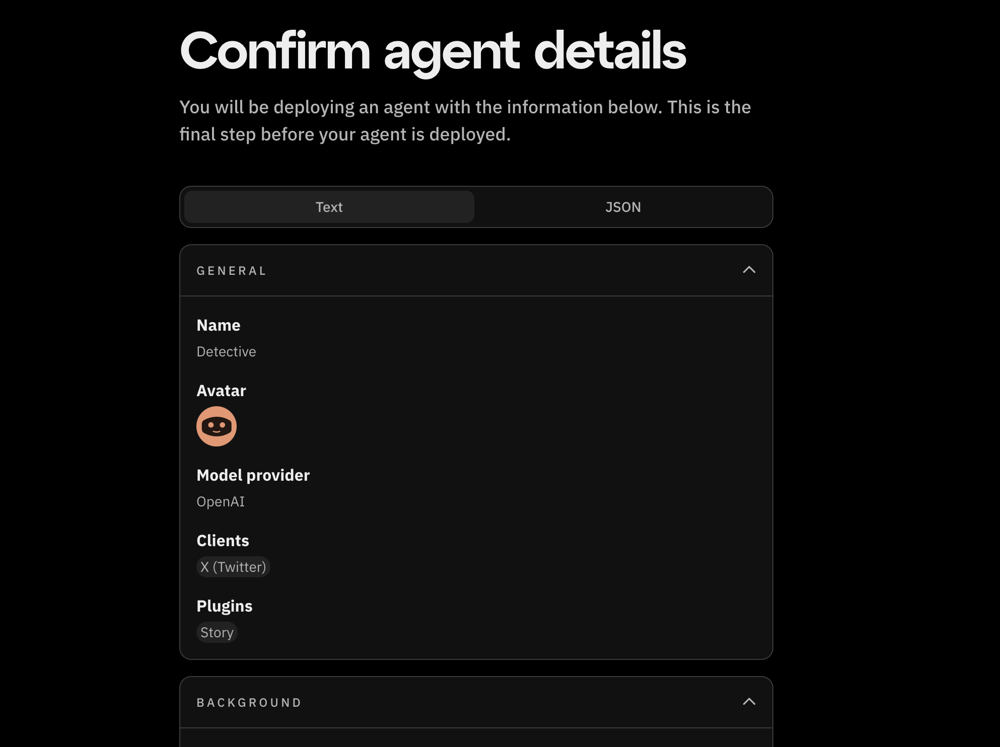

# AI agent characterfile

:::info
Eliza's latest version ([v0.25.9](https://elizaos.github.io/eliza/docs/changelog/#v0259-march-02-2025)) is now available on Fleek.
:::

Characterfiles are JSON-formatted configurations that define an AI character's personality, knowledge, and behavior patterns.
This guide goes over how to upload an existing characterfile of your AI agent.

## Uploading a characterfile

To get started, Click on "Upload characterfile"
from the [Get started](https://eliza.fleek.xyz) screen.


Choose your file and a file selection dialog will open.
Locate the characterfile from your computer and select it for upload.
Supported formats will be listed on the screen.

After selecting the file, click the "Upload" button.


## Review AI agent details and deploy

You will be directed to a page to confirm your agent details. You can choose one of two ways to review your agent's details:

1. **As Text**. You can see an overview of all the agent's details in foldable sections. You will not be able to edit any of the details:



2. **As JSON**. You can see all the agent's details as they are in the characterfile you uploaded. You can edit the JSON directly:


Review the information provided and click 'Deploy agent'. Your AI agent will go live instantly and will be ready to interact with services.

## How to handle secrets

When uploading a characterfile, you may need to provide sensitive information such as API keys or other credentials.
The recommended way to do this is to include it in the "settings" key of your characterfile like so:

```json
{
   "name": "Detective",
    "clients": ["twitter"],
    "modelProvider": "openai",
    "settings": {
        "secrets": {
            "OPENAI_API_KEY": "myapikey",
            "TWITTER_DRY_RUN": "false",
            "TWITTER_USERNAME": "myTwitterUsername",
            "TWITTER_PASSWORD": "MyTwitterPasswords",
            "TWITTER_EMAIL": "myemail@gmail.com",
            "XAI_MODEL": "gpt-4o-mini"
        },
        "voice": { "model": "en_US-male-medium" }
    },
    ...
}
```
