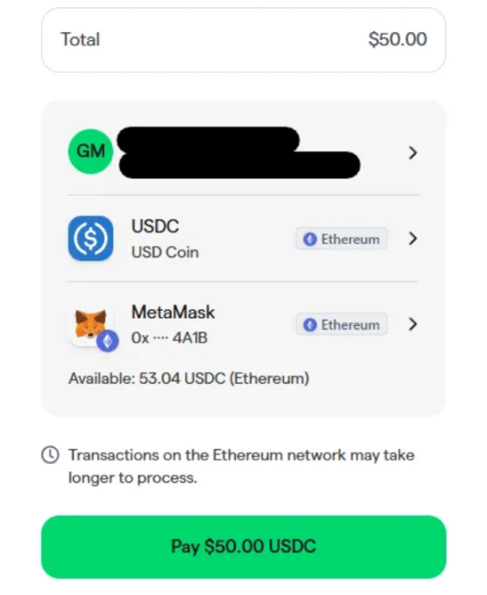

Paying for your **Fleek Plan using crypto** is simple and only takes a few minutes. Follow the steps below to fund your account and activate your subscription.

---

## **Step 1: Go to the AI Agents Tab**

Navigate to the [AI Agents tab](https://fleek.xyz/agents/) from your Fleek dashboard.

---

## **Step 2: Fund your Fleek Wallet**

Click on the Fleek Funds Wallet icon located at the top right of the page.

---

## **Step 3: Choose Amount and Payment Type**

- Select the amount you'd like to credit to your account.
- Make sure to choose **Crypto** as your payment method.

---

## **Step 4: Enter Details and Select Currency**

Fill in your basic information, then choose your preferred currency and network for the payment.

---

---

## **Step 5: Connect Your Wallet**

Connect your wallet (e.g., MetaMask, WalletConnect) to proceed with the payment.

---

## **Step 6: Confirm Payment**

Double-check all your information, then confirm and complete the transaction.

---

## **Step 7: Subscribe to a Plan**

Once your account is funded, click **Subscribe** when prompted to upgrade your plan. This will subscribe to the plan you selected, with the credits from your account.

---

Your **subscription will now deduct credits from your balance** on a monthly basis.
If your balance runs out, your subscription will be **paused** until you add more funds.

