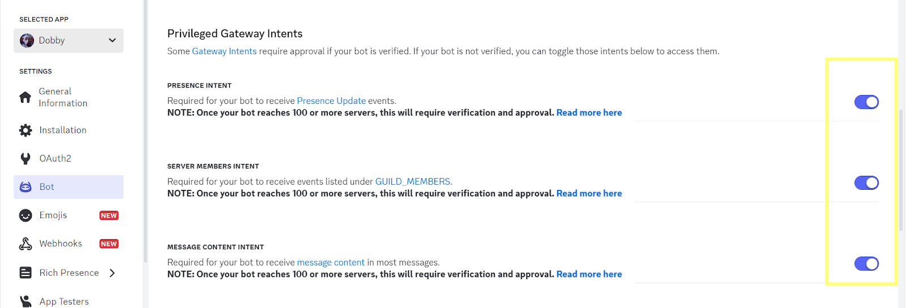

AI-powered agents are becoming an essential tool for automation, customer support, and interactive experiences. With the rise of **DeepSeek**, developers now have access to a powerful, open-source AI model that enables them to build intelligent applications with ease.

To make AI agent deployment even simpler and provide more optionality, **Fleek now integrates DeepSeek**, allowing users to spin up and host AI agents effortlessly. With just a few clicks, you can **deploy your own AI agent using a pre-made template**—no complicated setup required.

In this guide, we’ll walk you through **deploying an AI agent to Discord using Fleek**, demonstrating how you can have your bot up and running in minutes.

---

## **Overview of What We'll Build**

In this guide, we will **deploy an AI agent to Discord** using Fleek’s agent templates. Instead of dealing with complex server setups or manual configurations, we’ll leverage **Fleek’s seamless hosting** and DeepSeek’s powerful AI to get everything running quickly.

### **What This AI Agent Will Do**

- It will be able to **respond to messages** in a Discord server.
- You can **customize its personality**, making it casual, professional, or anything in between.
- It will run **entirely on Fleek**, so you won’t need to worry about infrastructure or maintenance.

### **Why Use Fleek for Deployment?**

- **Pre-made template** → No need to start from scratch.
- **Serverless hosting** → No manual server management required.
- **Fast setup** → Deploy in just a few minutes.

Now, let’s get started by obtaining the required API keys.

---

## **Step 1: Get Your DeepSeek API Key**

Before we can deploy our AI agent, we need to **obtain a DeepSeek API key**. This key allows our bot to interact with DeepSeek’s AI models and generate responses.

### **How to Get Your DeepSeek API Key**

1. **Go to the DeepSeek website** → https://platform.deepseek.com/api_keys
2. **Sign up or log in** → If you don’t have an account, create one.
3. **Navigate to the API section** → This is usually found in your account settings or dashboard.
4. **Generate an API key** → Click the button to create a new API key.
5. **Copy and store your key** → Keep this key safe, as you’ll need it in the next steps.

💡 **Tip:** Never share your API key publicly or expose it in your code. Use environment variables or a secure storage method when deploying your agent.

Now that we have the DeepSeek API key, let’s set up the **Discord keys** to allow our bot to interact with a server.

---

## **Step 2: Set Up Discord Keys**

Now that we have our **DeepSeek API key**, the next step is to set up the **Discord bot credentials** so our AI agent can interact with a Discord server. To do this, we need to generate a **Discord Bot Token and an Application ID** from the Discord Developer Portal.

### **How to Get Your Discord Bot Token**

1. **Go to the Discord Developer Portal** → https://discord.com/developers/applications
2. **Click “New Application”** → Give your bot a name (e.g., "Dobby") and create the application.
3. **Navigate to the "Bot" tab** → Click "Add Bot" to turn your application into a bot.
4. **Copy the Bot Token** → Click "Reset Token" and copy the new token (this will be used later).
5. **Enable necessary permissions** → In the "OAuth2" → "URL Generator" section, select:
   - bot (under OAuth2 scopes)
   - Permissions like Send Messages, Read Message History, and Use Slash Commands.

### **Enable Privileged Gateway Intents**

To ensure your bot can function properly, you need to **toggle on the following intents** in the Bot tab:

- **Presence Intent** → Required to track presence updates (optional for most bots).
- **Server Members Intent** → Needed to interact with guild members.
- **Message Content Intent** → Essential for responding to message content directly.

Make sure all three intents are **enabled**. These settings allow your bot to perform tasks like reading messages, responding to users, and interacting with server members effectively.

### **How to Get Your Application ID**

- The **Application ID** can be found on the main page of your app in the Developer Portal.
- Copy and store it safely alongside your Bot Token.

💡 **Important:** Keep your **Bot Token and Application ID** private! If your token gets leaked, anyone can control your bot.

Now that we have both **DeepSeek and Discord credentials**, it’s time to **customize our AI agent’s personality** before deployment!

---

## **Step 3: Customize Your AI Agent’s Personality**

Now that we have all the keys ready, it’s time to give your AI agent its unique personality. Head over to [**fleek.xyz/eliza/**](https://fleek.xyz/eliza/) and choose the option **“Start with a Template.”** For this guide, we’ll use the pre-designed **Dobby** template to create a fun, engaging AI agent.

### **Customizing Your AI Agent**

Fleek’s Eliza platform provides a variety of settings to make your AI agent truly unique. Follow these steps to customize:

- **Name:** Choose the display name for your AI agent. In this case, the agent will be named **Dobby**, representing a helpful and quirky personality.
- **Model Provider:** Toggle the option for **DeepSeek**, as it will power your AI agent’s responses.
- **Clients:** Select **Discord** to deploy your agent to a Discord server.

Once you’ve toggled **DeepSeek**, picked **Discord**, and made all your customizations, your personalized AI agent will be ready to deploy. For this guide, we’ll stick with the delightful **Dobby template**, but feel free to explore and make it your own!

---

### **Step 4: How to Deploy Your AI Agent**

With your customized AI agent ready, it’s time to bring it to life by deploying it on Fleek. The deployment process is simple and involves a few key steps, including reviewing your character and deploying your agent.

**How to Deploy Your AI Agent**

1. **Add Required Secrets**

   In the **“Add Secrets”** section, fill in the following keys:

   - **DEEPSEEK_API_KEY** → Paste the API key you obtained from DeepSeek.
   - **DISCORD_API_TOKEN** → Enter the Bot Token you created in the Discord Developer Portal.
   - **DISCORD_APPLICATION_ID** → Add the Application ID from your Discord application.

\*\*\*\*Adding an extra set of secrets is optional.

1. **Review Your Character**
   - Before deploying, click on **“Review Character”** to double-check all your customizations.
   - Confirm that everything, from the personality traits to the configurations, is set up as desired.
2. **Deploy Your Agent**
   - Once you’ve confirmed all settings are correct, click **“Deploy Agent.”** Fleek will handle the deployment process in just seconds.

3. **Visit the Dashboard and Access the Discord URL**
   - Once your agent is live, navigate to the **Dashboard** and:
     - Click **View Logs**.
     - Refresh the logs to ensure they are up to date.
     - Scroll to the very bottom of the logs to find the **Discord URL**.

4. **Invite Your Bot to a Server**
   - Paste the **Discord URL** in your browser.
   - Open it in your browser and follow the instructions to **invite the bot to any server of your preference**.

5. **Start Chatting!**
   - Once you’ve invited your bot to the server, it’s ready to chat! Send messages to test its responses and watch it come to life.

---

### **The 3-Minute Challenge**

Now that your AI agent is deployed and chatting, we challenge you to **deploy your own AI agent in under 5 minutes**.

Here’s how to join the fun:

1. Follow the steps outlined in this guide.
2. Time yourself to see how quickly you can get your agent live.
3. Once your agent is ready, **post your results on Twitter** and tag [Fleek](https://x.com/fleek).

We’re excited to see what you create! Ready, set… **deploy!** 🚀

**Resources:**

- Docs: https://fleek.xyz/docs/ai-agents/
- Template docs: https://fleek.xyz/docs/ai-agents/select-template/
- DeepSeek API docs:https://api-docs.deepseek.com/
