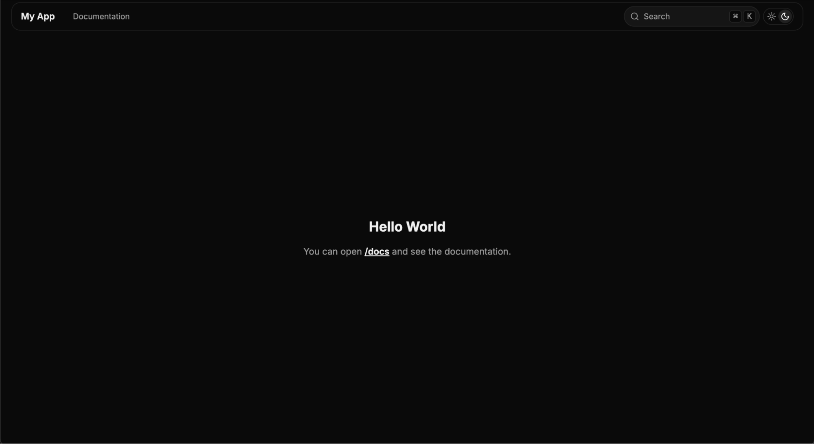
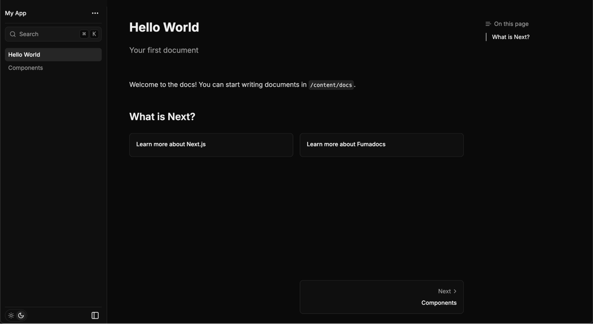

Building towards robust and fullstack developer tooling, we are excited to present Fullstack Next.js deployments on Fleek. Today we will be diving deep into Fumadocs and exploring how we can deploy Fumadocs on Fleek to help you quickly build an extremely performant documentation website.

---

# Fullstack Next.js with Fleek Next Adapter

The Fleek Next.js adapter enables seamless deployment of your server-side Next.js applications on Fleek. Built on [Fleek Functions](https://fleek.xyz/docs/cli/functions/) and powered by the Fleek Network, this adapter extends network capabilities to support full-stack Next.js apps on an unstoppable, edge-optimized infrastructure.

The Fleek Next Adapter opens doors to much more than standard Next.js deployments. We invite developers to experiment, build, and create powerful applications that address real-world challenges—while Fleek provides a high-performance, cost-effective, and open-source platform for your app’s infrastructure.

---

### Prerequisites

- Node 18+
- Fleek Account
- [Fleek CLI](https://www.npmjs.com/package/@fleek-platform/cli)
- [Fleek Next Adapter](https://www.npmjs.com/package/@fleek-platform/next)

---

### Setup

1. Start by installing the Fleek CLI.

```bash
// local installation
npm i @fleek-platform/cli

// global installation
npm i -g @fleek-platform/cli
```

💡: you can check the Fleek CLI version by running fleek -v. Any version >= 2.10.1 should be good.

2. Install the Fleek Next Adapter

```bash
// local installation
npm i @fleek-platform/next

// global installation
npm i -g @fleek-platform/next
```

💡: you can check the Fleek Next Adapter version by running `fleek-next -v`. Any version >= 2.1.0 should be good.

3. Install fumadocs using the automatic installation flow. Follow the terminal prompts and finish the installation.

```bash
npm create fumadocs-app
```

The installation flow should look something like this -

```bash
┌  Create Fumadocs App
│
◇  Project name
│  my-app
│
◇  Choose a content source
│  Fumadocs MDX
│
◇  Use Tailwind CSS for styling?
│  Yes
│
◇  Do you want to install packages automatically? (detected as npm)
│  Yes
│
│
●  Configured Typescript
│
●  Configured Tailwind CSS
◒  Generating Project│
●  Installed dependencies
│
●  Initialized Git repository
◇  Project Generated
│
└  Done


Open the project
cd my-app

Run Development Server
npm run dev | pnpm run dev | yarn dev

You can now open the project and start writing documents
kanishkkhurana@Kanishks-Air fuma % 
```

When run locally, the project will look something like this -



And, the /docs page will look like this -



---

### Using the Fleek Next Adapter

1. Add the following code to any routes that run server-side code to ensure they run on the edge.

```bash
export const runtime = 'edge'
```

In our case, we will be adding the above code to the following files - 
- /api/search/route.ts
- /docs/[[...slug]]/page.tsx

Please ensure that you remove the following code from /docs/[[slug]]/page.tsx

```javascript
// to be commented or removed from /docs/[[slug]]
export async function generateStaticParams() {
   return source.generateParams();
 }
```
2. Build the project using the Fleek Next Adapter

```bash
npx fleek-next build
# or if installed globally
fleek-next build
```

💡: If you are running the command outside of your project's root dir, you can set the path to it with the project path flag `-p/--projectPath`:

```bash
fleek-next build -p path/to/my/repo
```
The build flow should look something like this -

```bash
 > Building Next.js App
⚡️ @fleek-platform/next-on-fleek CLI v.1.15.0
⚡️ Detected Package Manager: npm (9.8.1)
⚡️ Preparing project...
⚡️ Project is ready
⚡️ Building project...
▲  Vercel CLI 37.13.0
▲  Installing dependencies...
▲  > my-app@0.0.0 postinstall
▲  > fumadocs-mdx
▲  [MDX] types generated
▲  up to date in 607ms
▲  158 packages are looking for funding
▲  run `npm fund` for details
▲  Detected Next.js version: 15.0.0
▲  Running "npm run build"
▲  > my-app@0.0.0 build
▲  > next build
▲  ▲ Next.js 15.0.0
▲  - Experiments (use with caution):
▲    · turbo
▲  Creating an optimized production build ...
▲  [MDX] initialized map file
▲  ✓ Compiled successfully
▲  Linting and checking validity of types ...
▲  Collecting page data ...
▲  ⚠ Using edge runtime on a page currently disables static generation for that page
▲  Generating static pages (0/4) ...
▲  Generating static pages (1/4) 
▲  Generating static pages (2/4) 
▲  Generating static pages (3/4)
▲  ✓ Generating static pages (4/4)
▲  Finalizing page optimization ...
▲  Collecting build traces ...
▲  
▲  Route (app)                              Size     First Load JS
▲  ┌ ○ /                                    172 B           108 kB
▲  ├ ○ /_not-found                          899 B           100 kB
▲  ├ ƒ /api/search                          136 B          99.4 kB
▲  └ ƒ /docs/[[...slug]]                    11.3 kB         157 kB
▲  + First Load JS shared by all            99.3 kB
▲  ├ chunks/215-a4345262cfe926b0.js       44.6 kB
▲  ├ chunks/4bd1b696-f30c9099448122a7.js  52.6 kB
▲  └ other shared chunks (total)          2.07 kB
▲  ○  (Static)   prerendered as static content
▲  ƒ  (Dynamic)  server-rendered on demand
▲  Traced Next.js server files in: 187.249ms
▲  Created all serverless functions in: 43.749ms
▲  Collected static files (public/, static/, .next/static): 2.296ms
▲  Build Completed in .vercel/output [18s]
⚡️ Completed `npx vercel build`.

⚡️ Build Summary (@fleek-platform/next-on-fleek v1.15.0)
⚡️ 
⚡️ Edge Function Routes (2)
⚡️   ┌ /api/search
⚡️   └ /docs/[[...slug]]
⚡️ 
⚡️ Prerendered Routes (2)
⚡️   ┌ /
⚡️   └ /index.rsc
⚡️ 
⚡️ Other Static Assets (43)
⚡️   ┌ /_app.rsc.json
⚡️   ├ /_document.rsc.json
⚡️   ├ /_error.rsc.json
⚡️   ├ /404.html
⚡️   └ ... 39 more

⚡️ Build log saved to '.vercel/output/static/_worker.js/nop-build-log.json'
⚡️ Generated '.vercel/output/static/_worker.js/index.js'.
⚡️ Build completed in 0.46s
✅ Success! Next.js app successfully built
✅ Success! Next.js app successfully bundled
✅ Success! Copied static assets successfully
🏁 Ready! Your Next.js app has been successfully built

🤖 Deploy your app by running the following command:
 ┌───────────────────────────────────────────────────────────────────────────────────────────┐
 │ fleek functions deploy --bundle=false --path .fleek/dist/index.js --assets .fleek/static  │
 └───────────────────────────────────────────────────────────────────────────────────────────┘
💡 Make sure to create a function first using `fleek functions create`
```
3. Now, Create the Fleek Function using the Fleek CLI

```bash
//syntax
fleek functions create --name '<name of your function>'

//example
fleek functions create --name fumadocs
```

4. Finally, deploy using the Fleek CLI

```bash
//syntax
fleek functions deploy --bundle=false --path .fleek/dist/index.js --assets .fleek/static --name '<name of your function>'

//example
fleek functions deploy --bundle=false --path .fleek/dist/index.js --assets .fleek/static --name fumadocs
```

As you complete all the steps successfully here, you will be able to access your fullstack Next.js app using a link that looks like this-
https://hundreds-action-shrilling.functions.on-fleek.app

---

Congratulations! With this you have completed the tutorial and successfully deployed a fumadocs template on Fleek as a fullstack Next.js app. You can now expand your learning to build interesting use cases on Next.js and execute them as a Fleek Functions for scalable and performant execution and ensure that your apps exist perpetually. 

To learn more about the benefits of building fullstack Next.js apps with Fleek, click here. 


