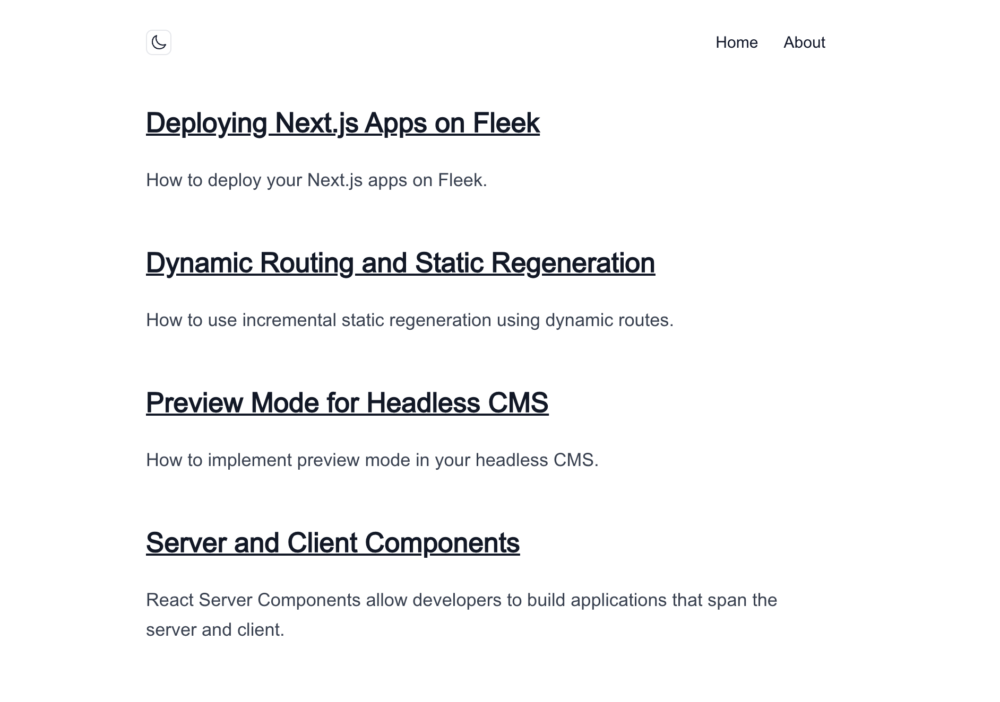

We’re excited to introduce full-stack Next.js deployments on Fleek! Our Fleek Next adapter is designed to provide developers with powerful and comprehensive tooling. In this guide, I’ll walk you through setting up and deploying a content layer on Fleek to build a fully functional documentation portal.

---

# Fullstack Next.js with Fleek Next Adapter

The Fleek Next.js adapter allows you to deploy your server-side Next.js application on Fleek. It leverages the already existing [Fleek Functions](https://fleek.xyz/docs/cli/functions/) infrastructure on Fleek Network, to extend the capabilities of the network and host fullstack Next.js apps onchain.

The use cases for Fleek Next Adapter go way beyond just deploying basic Next.js apps and we encourage developers to try the tool and build amazing apps that solve real world problems, while Fleek provides a more performant, lower cost, easier to maintain, self-sovereign infrastructure to your apps.

---

## Prerequisites

- Node 18+
- Fleek Account
- [Fleek CLI](https://www.npmjs.com/package/@fleek-platform/cli)
- [Fleek Next Adapter](https://www.npmjs.com/package/@fleek-platform/next)

---

### Setup

1. Start by installing the Fleek CLI.

```bash
// local installation

npm i @fleek-platform/cli

// global installation

npm i -g @fleek-platform/cli
```

💡You can check the Fleek CLI version by running fleek -v. Any version >= 2.10.1 should be good.

2. Install the Fleek Next Adapter

```bash
// local installation

npm i @fleek-platform/next

// global installation

npm i -g @fleek-platform/next
```

💡You can check the Fleek Next Adapter version by running fleek-next -v. Any version >= 1.0.6 should be good.

3. Fork the [contentlayer repository](https://github.com/fleek-tools/contentlayer-blog-on-fleek-nextjs), and then clone it.

```bash
git clone https://github.com/<your-id>/fleek-contentlayer.git
```

When run locally, the project will look something like this:



---

### Using the Fleek Next Adapter

1. Build the project using the Fleek Next Adapter:

```bash
npx fleek-next build
or if installed globally
fleek-next build
```

2. Now, Create the Fleek Function using the Fleek CLI:

```bash
//syntax
fleek functions create --name '<name of your function>'
//example
fleek functions create --name contentlayer
```

3. Finally, deploy using the Fleek CLI:

```bash
//syntax
fleek functions deploy --bundle=false --path .fleek/dist/index.js --assets .fleek/static --name '<name of your function>'

//example
fleek functions deploy --bundle=false --path .fleek/dist/index.js --assets .fleek/static --name contentlayer
```

💡If you’re running the command outside of your project's root dir, you can set the path to it with the project path flag -p/--projectPath:

As you complete all the steps successfully here, you will be able to access your fullstack Next.js app using a link that looks like this:
[https://billions-parrot-rhythmic.functions.on-fleek.app/](https://billions-parrot-rhythmic.functions.on-fleek.app/)

---

Congratulations! You've successfully completed the tutorial and deployed a content layer template on Fleek as a fullstack Next.js app. From here, you can continue exploring and building exciting use cases with Next.js, executing them as Fleek Functions for scalable,high-performance solutions.

To learn more about the benefits of building fullstack Next.js apps with Fleek, click here.
