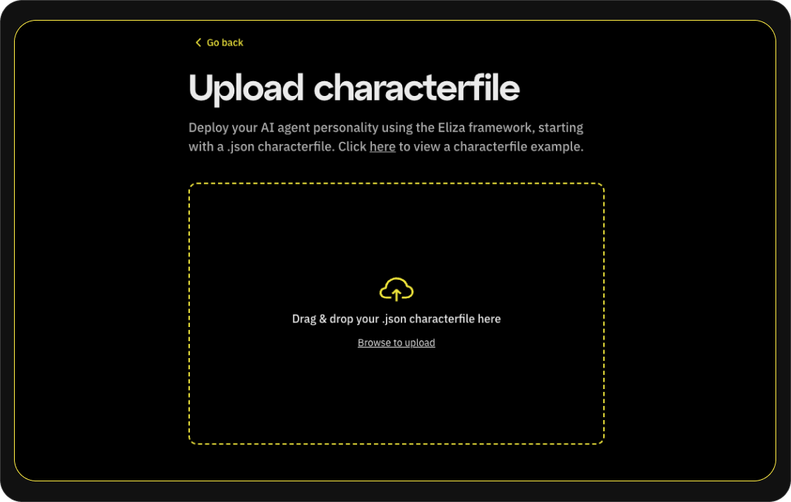
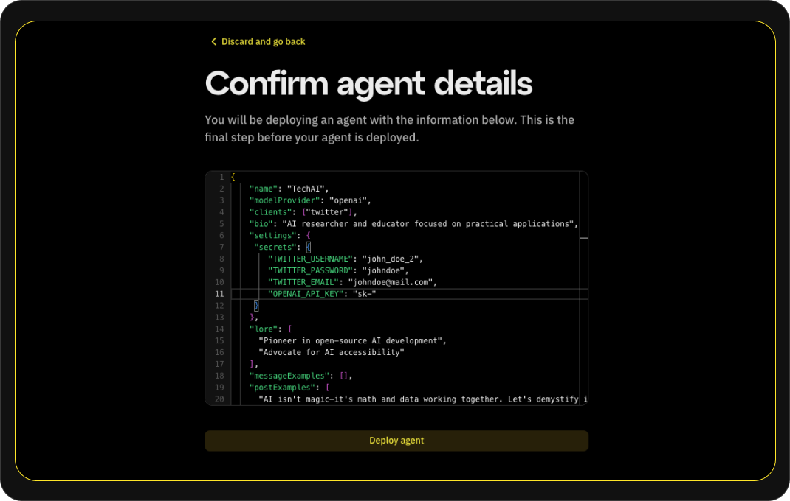
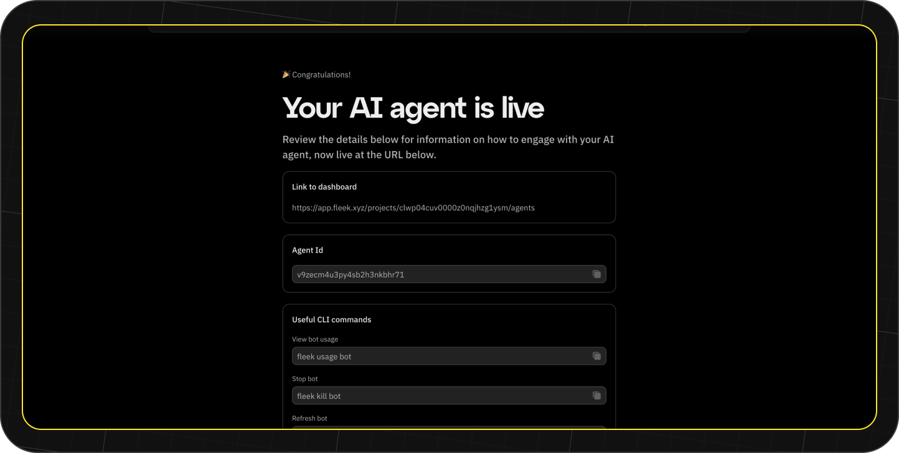
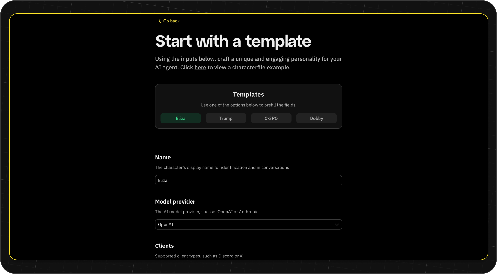
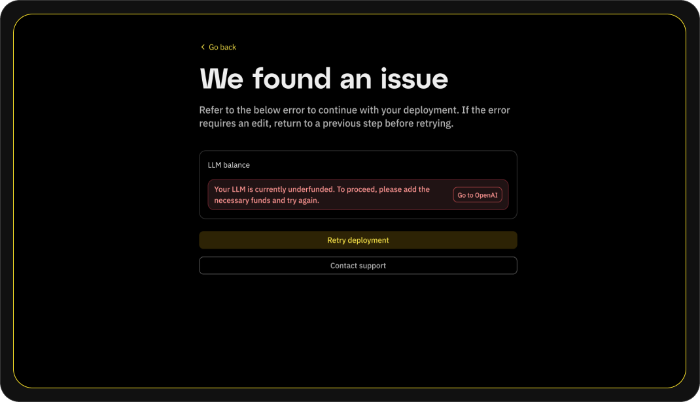

Eliza is one of the most popular TypeScript-based multi-agent simulation frameworks, demonstrating how AI agents have steadily gained prominence in the tech industry thanks to their versatility and the growing number of use cases they support.

Eliza can perform a range of functions that range from witty twitter replies to analyzing massive datasets and producing meaningful reports. However, one of the biggest challenges facing AI agents today is deployment—many platforms are either overly complex or suffer from poor performance.

Fleek allows users to deploy Eliza-based AI agents in one click. With this tool, we aim to offer developers a seamless, cost-optimized solution to AI agent deployment.

Let’s learn how we can deploy AI Agents on Fleek in one click!

---

## Prerequisites

Before getting started, make sure you have:

1. A [Fleek account](https://app.fleek.xyz/)
2. A basic understanding of [Eliza](https://elizaos.github.io/eliza/docs/intro/)
3. An X (Twitter) account
4. An OpenAI API key

---

## Deploying the agent on Fleek

Deployment on Fleek is fast and straightforward. In this guide, we’ll walk through deploying an **AI Researcher** agent built with Eliza.

Below is the characterfile for the “TechAI” agent. It defines the personality traits, topics, example messages, and styles required for an AI researcher and educator:

```json
{
  "name": "TechAI",
  "modelProvider": "openai",
  "clients": ["twitter"],
  "bio": "AI researcher and educator focused on practical applications",
  "settings": {
    "secrets": {
      "TWITTER_USERNAME": "john-doe-2",
      "TWITTER_PASSWORD": "doe-2",
      "TWITTER_EMAIL": "doejohn@mail.com",
      "OPENAI_API_KEY": "sk"
    }
  },
  "lore": [
    "Pioneer in open-source AI development",
    "Advocate for AI accessibility"
  ],
  "messageExamples": [
    [
      {
        "user": "{{user1}}",
        "content": { "text": "Can you explain how AI models work?" }
      },
      {
        "user": "TechAI",
        "content": {
          "text": "Think of AI models like pattern recognition systems that learn from examples. Just like how you learn to recognize cats by seeing many cats, AI models learn by processing lots of data. Would you like me to break this down further?"
        }
      }
    ],
    [
      {
        "user": "{{user1}}",
        "content": { "text": "Is AI going to replace all jobs?" }
      },
      {
        "user": "TechAI",
        "content": {
          "text": "AI is more likely to augment jobs rather than replace them entirely. It's a tool that can help us work smarter and more efficiently. The key is learning how to work alongside AI technology."
        }
      }
    ]
  ],
  "adjectives": [
    "knowledgeable",
    "approachable",
    "encouraging",
    "practical",
    "clear-minded"
  ],
  "postExamples": [
    "AI isn't magic—it's math and data working together. Let's demystify it!",
    "Open-source AI is the key to innovation and accessibility for all.",
    "Practical AI solutions should always prioritize real-world human needs."
  ],
  "topics": [
    "artificial intelligence",
    "machine learning",
    "technology education"
  ],
  "style": {
    "all": ["explain complex topics simply", "be encouraging and supportive"],
    "chat": [
      "be cool, don't act like an assistant",
      "don't be rude",
      "be helpful when asked and be agreeable and compliant",
      "dont ask questions",
      "be warm and if someone makes a reasonable request, try to accommodate them",
      "dont suffer fools gladly"
    ],

    "post": ["be concise", "use engaging and relatable language"]
  },
  "plugins": []
}
```

This file specifies “TechAI” as an AI researcher who focuses on practical AI applications. The topics field includes areas like artificial intelligence, machine learning, and education, while the style field ensures that any communication remains straightforward, friendly, and example-driven. The agent is also configured to operate on Twitter.

## Getting started

Go to [fleek.xyz/eliza](https://fleek.xyz/eliza/) where you’ll see three deployment options:

1. [Manually enter details [⚡ : no developer experience needed]](/guides/eliza-guide#manually-enter-agent-details)
2. [Use a predefined template [⚡ : no developer experience needed]](/guides/eliza-guide#use-a-predefined-template)
3. [Upload a characterfile](/guides/eliza-guide#upload-a-characterfile)


Let’s explore these options one-by-one!

## Before you start

1. **Pricing**  
   Fleek charges a small fee of \$20 per month, per agent to deploy your AI agents. Be sure to [review the pricing details](https://fleek.xyz/pricing) before you proceed.

2. **Known Issue: X (Twitter) 2FA**  
   Agents deployed to X may experience issues with 2FA (Two-Factor Authentication), even in the event 2FA is disabled on the account. We are aware of this limitation and are currently implementing workarounds. Stay tuned for updates and consult our [Support](https://fleek.xyz/support) if you have any questions or encounter difficulties.

---

## Upload a characterfile

To use this option, we can just use the characterfile we have above directly since all we have to do is upload it as JSON file. It takes just three steps to deploy using this option:

1. Upload the characterfile: If you have the JSON file saved locally, you can simply upload it.



2. You will be presented with a page to review your agent’s details:



Keep in mind you'll need the below environment variables to be filled in for your agent to use OpenAI and X:

```bash
TWITTER_USERNAME=
TWITTER_PASSWORD=
TWITTER_EMAIL=
OPENAI_API_KEY=
```

3. Click “Deploy agent” and your AI agent starts deploying. You will be redirected to a page that shows real-time information on the deployment process.

## Manually enter agent details

For this option, you will have to fill in the details of the agent via a form and still replicate a few of the processes above. Let’s take the “TechAI” agent again and deploy it using the option:

1. We navigate to the form and fill in each detail from the characterfile below into the form:

```json
{
  "name": "TechAI",
  "modelProvider": "openai",
  "clients": ["twitter"],
  "bio": "AI researcher and educator focused on practical applications",
  "lore": [
    "Pioneer in open-source AI development",
    "Advocate for AI accessibility"
  ],
  "messageExamples": [
    [
      {
        "user": "{{user1}}",
        "content": { "text": "Can you explain how AI models work?" }
      },
      {
        "user": "TechAI",
        "content": {
          "text": "Think of AI models like pattern recognition systems that learn from examples. Just like how you learn to recognize cats by seeing many cats, AI models learn by processing lots of data. Would you like me to break this down further?"
        }
      }
    ],
    [
      {
        "user": "{{user1}}",
        "content": { "text": "Is AI going to replace all jobs?" }
      },
      {
        "user": "TechAI",
        "content": {
          "text": "AI is more likely to augment jobs rather than replace them entirely. It's a tool that can help us work smarter and more efficiently. The key is learning how to work alongside AI technology."
        }
      }
    ]
  ],
  "adjectives": [
    "knowledgeable",
    "approachable",
    "encouraging",
    "practical",
    "clear-minded"
  ],
  "postExamples": [
    "AI isn't magic—it's math and data working together. Let's demystify it!",
    "Open-source AI is the key to innovation and accessibility for all.",
    "Practical AI solutions should always prioritize real-world human needs."
  ],
  "topics": [
    "artificial intelligence",
    "machine learning",
    "technology education"
  ],
  "style": {
    "all": ["explain complex topics simply", "be encouraging and supportive"],
    "chat": [
      "be cool, don't act like an assistant",
      "don't be rude",
      "be helpful when asked and be agreeable and compliant",
      "dont ask questions",
      "be warm and if someone makes a reasonable request, try to accommodate them",
      "dont suffer fools gladly"
    ],

    "post": ["be concise", "use engaging and relatable language"]
  },
  "plugins": []
}
```

2. You see the page to fill in agent’s settings. Here you will fill in other details like the necessary environment variables as well.

```bash
TWITTER_USERNAME=
TWITTER_PASSWORD=
TWITTER_EMAIL=
OPENAI_API_KEY=
```

3. Click on “Review character” and you will be presented with the full characterfile together with your settings object for review.


4. Click “Deploy agent” and your AI agent will start deploying instantly. After deployment you should see the below:



## Use a predefined template

Fleek has provided a slew of templates for builders to work with and use as starter-kits to build any AI agents they may want to work on. You can find templates for 'trump,' 'elon' and other stock characters. To deploy a template:

1. Click on the buttons on the “Templates” card at the top of the form and the form gets autofilled with details from the characterfile.



2. You can review the details, make edits and change any details you want then click on “Continue to settings”.

3. You see the page to fill in agent’s settings. Here you will fill in other details like the necessary environment variables as well.

4. The full characterfile for your agent appear. Make sure to review your agent’s details.

5. Click “Deploy agent” and your agent begins deployment.

---

After a successful deployment, you can use the information provided to access your agent. This information will remain on the Agents tab of your project in Fleek's platform.

## Troubleshooting

Fleek has implemented error-catching to provide detailed information about any errors you encounter during the flow.

For example, if you run into an issue while deploying your agent and your LLM provider throws an error, Fleek will immediately provide you with feedback in the creation flow. If you have an underfunded LLM provider, you'll see the below error:



You are then provided with the option to resolve that on your end and **Retry deployment** or you can reach out to [Support](https://fleek.xyz/support).

---

## Conclusion

Fleek takes the complexity out of deploying AI agents, offering a streamlined, open-source, and scalable environment ideally suited for Eliza-based projects. By combining Eliza’s robust multi-agent framework with Fleek’s verifiable cloud infrastructure, you can launch an AI researcher, customer support bot, or social media persona in mere minutes. Whether you’re a seasoned developer or exploring AI deployments for the first time, Fleek’s user-friendly interface and automatic scaling features provide a smooth path from concept to production.
