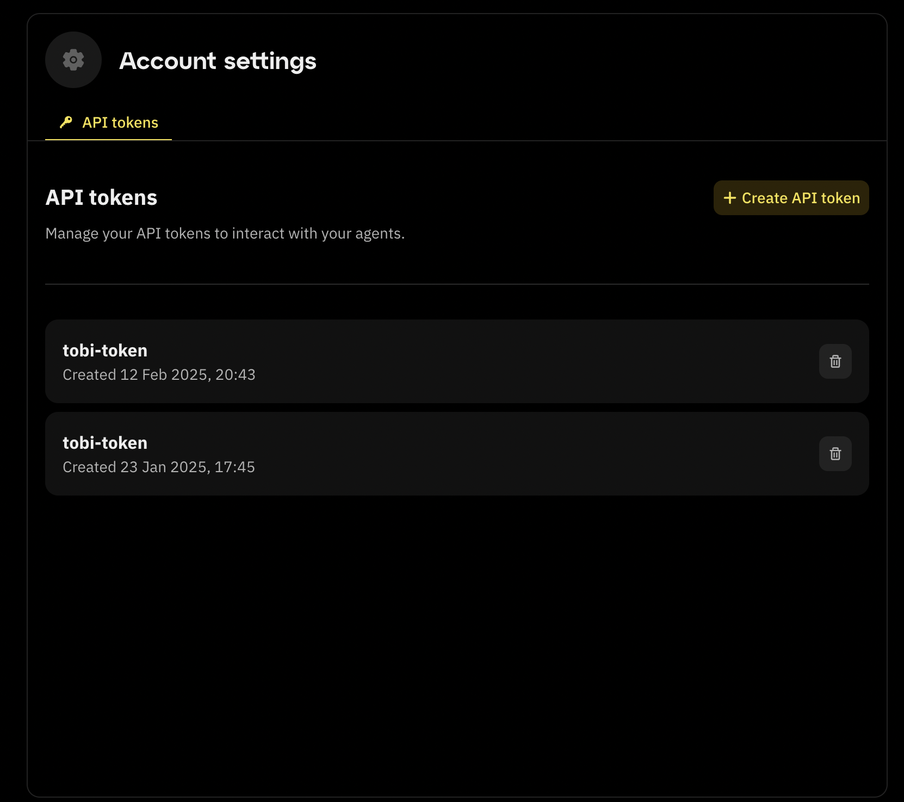
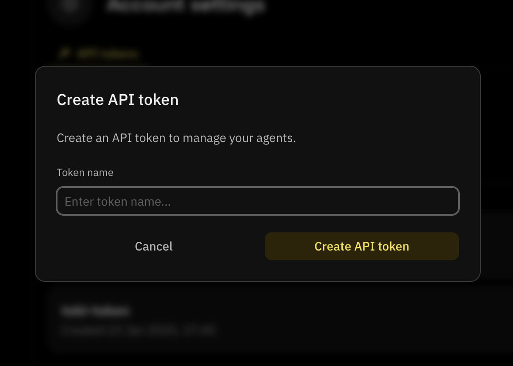

## Introduction

This guide provides step-by-step instructions on how to use the Fleek AI Agents API. It covers all available requests, authentication methods, and practical examples to help users interact with the API, even if they are new to it.

## Authentication

To use the API, you need an X-Api-Key. Follow these steps to retrieve it:

### 1. Generate Your X-Api-Key

To get an API key:

1. Go to the [fleek.xyz/eliza](https://fleek.xyz/eliza) page. Click on the "Account settings" button at the bottom of the page.

2. The "API tokens" tab shows up with all the API keys you have created.



3. To get an API key from the Eliza deployment page, click on the "Create API token" button and a modal appears.
4. Type in the name of the API key you want to create and click on the "Create API token" button.



Use the token field as your X-Api-Key for all API requests.

---

## API Requests

### 1. List All AI Agents

This request retrieves all AI agents associated with your Fleek account.

**Request:** GET /api/v1/ai-agents

**Example:**

```bash
curl 'https://api.fleek.xyz/api/v1/ai-agents?size=10' \

--header 'X-Api-Key: YOUR_SECRET_TOKEN'
```

**Response example:**

```json
{
  "data": [
    {
      "id": "agent_id",

      "projectId": "project_id",

      "name": "AgentName",

      "avatar": null,

      "status": "Created",

      "character_file": "{...}",

      "host": "server_ip",

      "slotNumber": "user_specific_slot_number",

      "createdBy": "user_id",

      "createdAt": "user_specific_created_timestamp",

      "updatedAt": "user_specific_updated_timestamp",

      "deletedAt": null
    }
  ],

  "next_page": null,

  "prev_page": null
}
```

- Replace your_x_api_key with your API key

---

### 2. Create an AI Agent draft

This request allows you to create a new AI agent draft on Fleek, to upload it later.

**Request:** POST /api/v2/ai-agents

**Example:**

```bash

curl https://api.fleek.xyz/api/v2/ai-agents \

--request POST \

--header 'Content-Type: application/json' \

--header 'X-Api-Key: YOUR_SECRET_TOKEN' \

--data '{

"avatar": "dGVzdGltYWdlZGF0YQ==",

"config": "{PUT_YOUR_JSON_CONFIGURATION_HERE_AS_A_STRING}",

"name": "AI_Agent_name",

"projectId": "your_project_id"

}'
```

**Response example:**

```json
{
  "id": "your_agent_id",

  "projectId": "your_project_id",

  "name": "Your Agent's Name",

  "avatar": null,

  "status": "Draft",

  "characterFile": "{\"foo\":\"valid Eliza character configuration\"}",

  "createdBy": "your_user_id",

  "createdAt": "",

  "updatedAt": ""
}
```

- Replace your_x_api_key with your API key
- Replace {PUT_YOUR_JSON_CONFIGURATION_HERE_AS_A_STRING} with your character file json string
- Replace AI_Agent_name with your Agent name
- Replace your_project_id with your project ID

---

### 3. Publish a draft AI

This request allows you to publish your AI agent draft on Fleek.

**Request:** POST /api/v1/ai-agents/{agentId}/publish

**Example:**

```bash
curl 'https://api.fleek.xyz/api/v1/ai-agents/{agentId}/publish' \

--request POST \

--header 'X-Api-Key: your_x_api_key'

```

**Response example:**

```json
{
  "avatar": "dGVzdGltYWdlZGF0YQ==",

  "characterFile": "{\"foo\":\"valid Eliza character configuration\"}",

  "createdAt": "",

  "createdBy": "your_user_id",

  "id": "your_agent_id",

  "name": "Your Agent's Name",

  "projectId": "your_project_id",

  "status": "Created",

  "updatedAt": ""
}
```

- Replace your_x_api_key with your API key
- Replace {agentId} with the ID of the agent you want to publish the draft.

---

### 4. Get an AI Agent

This request fetches details of a specific AI agent using its ID.

**Request:** GET /api/v1/ai-agents/{agent_id}

**Example:**

```bash
curl 'https://api.fleek.xyz/api/v1/ai-agents/{agentId}' \

--header 'X-Api-Key: your_x_api_key'
```

**Response example:**

```json
{
  "id": "agent_id",

  "projectId": "your_project_id",

  "name": "AgentName",

  "avatar": null,

  "status": "Created",

  "character_file": "{...}",

  "host": "server_ip",

  "slotNumber": "user_specific_slot_number",

  "createdBy": "user_id",

  "createdAt": "user_specific_created_timestamp",

  "updatedAt": "user_specific_updated_timestamp",

  "deletedAt": null
}
```

- Replace your_x_api_key with your API key
- Replace {agentId} with your actual agent ID.

---

### 5. Update an AI Agent

Use this request to modify the name or character file of an AI agent.

**Request:** PUT /api/v1/ai-agents/{agent_id}

**Example:**

```bash
curl 'https://api.fleek.xyz/api/v1/ai-agents/{agentId}' \

--request PUT \

--header 'Content-Type: application/json' \

--header 'X-Api-Key: your_x_api_key' \

--data '{

"avatar": "dGVzdGltYWdlZGF0YQ==",

"characterFile": "{UPDATED_JSON_CONFIGURATION_AS_STRING}",

"name": "UpdatedAgentName"

}'
```

**Response example:**

```json
{
  "id": "new_agent_id",

  "projectId": "your_project_id",

  "name": "UpdatedAgentName",

  "avatar": null,

  "status": "Created",

  "character_file": "{...}",

  "host": "server_ip",

  "slotNumber": "user_specific_slot_number",

  "createdBy": "user_id",

  "createdAt": "user_specific_created_timestamp",

  "updatedAt": "user_specific_updated_timestamp",

  "deletedAt": null
}
```

- Replace {agentId} with your actual agent ID.
- Replace your_x_api_key with your API key
- Replace {UPDATED_JSON_CONFIGURATION_AS_STRING} with your character file json string
- Replace UpdatedAgentName with your new Agent name

---

### 6. Delete an AI Agent

This request removes an AI agent from your Fleek account.

**Request:** DELETE /api/v1/ai-agents/{agent_id}

**Example:**

```bash
curl 'https://api.fleek.xyz/api/v1/ai-agents/{agentId}' \

--request DELETE \

--header 'X-Api-Key: your_x_api_key'
```

**Response example:**

```json
{
  "message": "AI Agent deleted successfully"
}
```

- Replace {agentId} with your actual agent ID.
- Replace your_x_api_key with your API key

---

### 7. Get the logs from an AI agent

To retrieve the logs of an AI agent, use the following request:

**Request:** GET /api/v1/ai-agents/{agentId}/logs

**Example:**

```bash
curl 'https://api.fleek.xyz/api/v1/ai-agents/{agentId}/logs' \

--header 'X-Api-Key: your_x_api_key'
```

**Response example:**

```json
{
  "data": [
    {
      "id": "s=a6542de1ed8c4c5c98a9080c5dc1e96d;i=17673;b=5956ed0f842c4e01a08da7328fc9a960;m=13a9e975565;t=62e066a5c73c6;x=fb2de8833a54362e",

      "timestamp": 1739454949,

      "message": "  TestforFleek123456 ",

      "priority": 6
    }
  ],

  "next_page": "https://api.fleek.xyz/api/v1/ai-agents/{agentId}/logs?cursor=...",

  "prev_page": null
}
```

- Replace {agentId} with your actual agent ID.
- Replace your_x_api_key with your API key.
- Logs contain id, timestamp, message, and priority levels.

---

### 8. Get the Status of an AI Agent

This request retrieves the status of an AI agent.

**Request:** GET /api/v1/ai-agents/{agentId}/status

**Example:**

```bash
curl 'https://api.fleek.xyz/api/v1/ai-agents/{agentId}/status' \

--header 'X-Api-Key: your_x_api_key'
```

**Response example:**

```json
{
  "status": "true"
}
```

- Replace {agentId} with your actual agent ID.
- Replace your_x_api_key with your API key.

---

### 9. Start an AI agent

To start an AI agent, use the following request:

**Request:** POST /api/v1/ai-agents/{agentId}/start

**Example:**

```bash
curl 'https://api.fleek.xyz/api/v1/ai-agents/{agentId}/start' \

--request POST \

--header 'X-Api-Key: your_x_api_key'

- Replace {agentId} with your actual agent ID.
- Replace your_x_api_key with your API key.
```

---

### 10. Stop an AI agent

To stop an AI agent, use the following request:

**Request:** POST /api/v1/ai-agents/{agentId}/stop

**Example:**

```bash
curl 'https://api.fleek.xyz/api/v1/ai-agents/{agentId}/stop' \

--request POST \

--header 'X-Api-Key: your_x_api_key'

- Replace {agentId} with your actual agent ID.
- Replace your_x_api_key with your API key.
```

---

### 11. Get the attestation bytes for an AI agent

This endpoint is used to get the attestation bytes for an AI agent.

**Request:** GET api/v1/ai-agents/{agentId}/attestation

**Example:**

```bash
curl 'https://api.fleek.xyz/api/v1/ai-agents/{agentId}/attestation' \

--header 'X-Api-Key: your_x_api_key'

- Replace {agentId} with your actual agent ID.
- Replace your_x_api_key with your API key.
```

---

### 12. Proxy requests to the AI agent's API

This endpoint is used to proxy requests to the AI agent API. Any method is supported (GET, POST, PUT, DELETE, etc.). It will forward the request to the AI agent API and return the response.

**Request:** GET /api/v1/ai-agents/{agentId}/api/{\*key}

**Example:**

```bash
curl 'https://api.fleek.xyz/api/v1/ai-agents/{agentId}/api/{*key}' \

--header 'X-Api-Key: your_x_api_key'

- Replace {agentId} with your actual agent ID.
- Replace your_x_api_key with your API key.
```

### Conclusion

This guide provides a comprehensive overview of the Fleek AI Agents API, covering authentication, agent management, logging, and status monitoring. By following the step-by-step instructions, users can seamlessly interact with the API to create, update, and manage AI agents efficiently.

For additional support or further assistance, please visit our [Support Center](https://fleek.xyz/support/).
