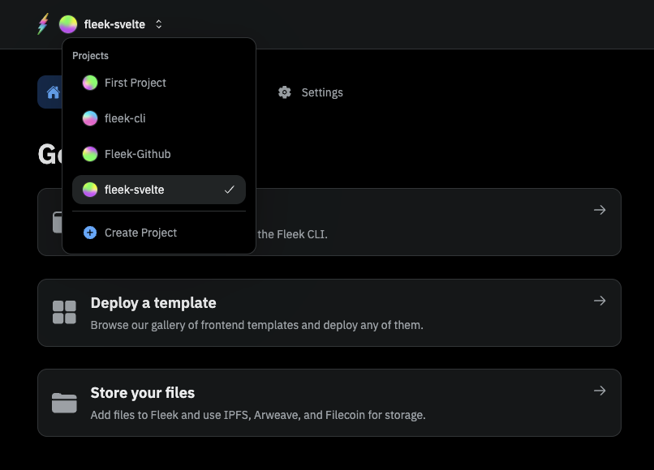
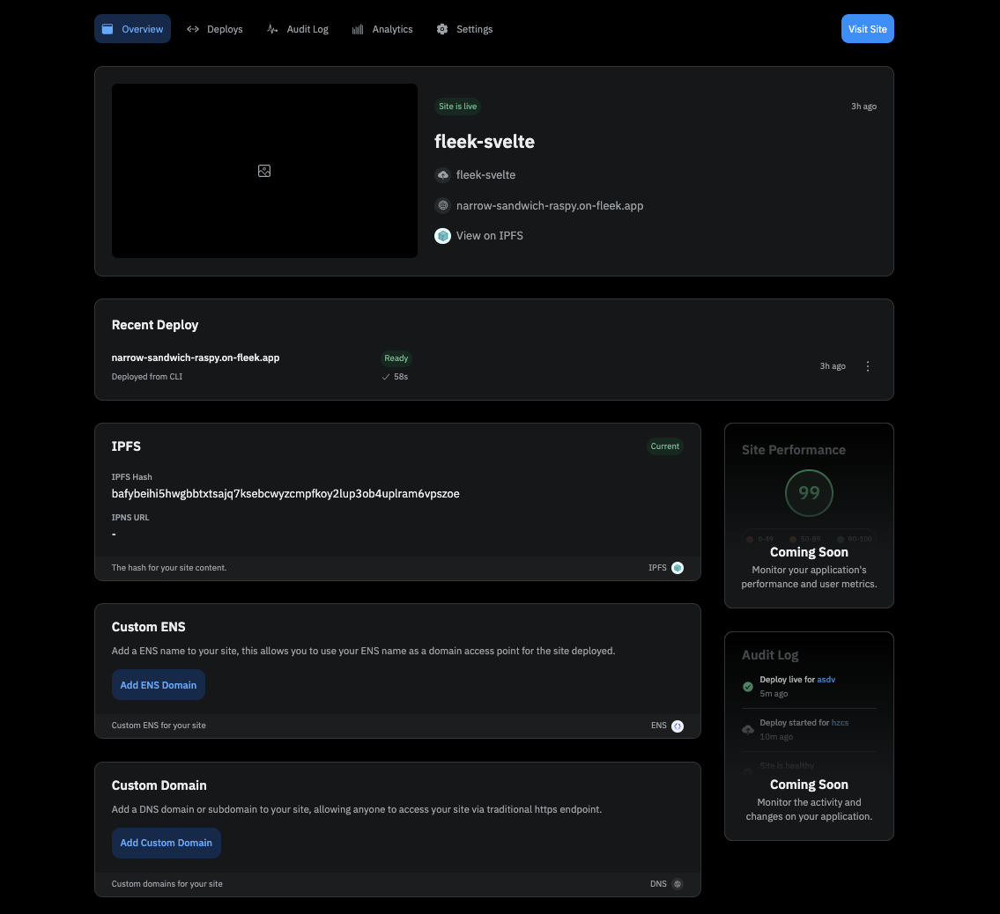

The Fleek.xyz platform empowers developers to build lightning-fast web apps, and services that are edge optimized for performance. In this detailed guide, you’ll learn how to deploy a Svelte web app onto Fleek using the Fleek CLI.

### What is Svelte?

Svelte is a modern JavaScript framework that rethinks how web applications are built. Unlike traditional frameworks where components are interpreted at runtime, Svelte shifts much of this work to build time, producing highly optimized and efficient code.

### Requirements:

- Fleek Account
- FleekCLI Installation (preferably - v0.7.3)
- GitHub Account
- NodeJs 18+(preferably - v18.17.0)

Let’s get started:

---

## Create A New Svelte Project

The first thing we’ll do will be to set up our Svelte project.

To create a new Svelte project open your terminal, `cd` into the directory of your choice, and run the following command:

```tsx
git clone https://github.com/fleekxyz/svelte-template.git
```

### Start Up Your Dev Server

After cloning, we’ll need to `cd` into the directory we created and start our dev server. To do that while still in our terminal, run the following command:

```jsx
cd svelte-template && npm i && npm run dev
```

This will install the dependencies, and start up the Svelte web app. We can visit it by opening http://localhost:5173 on our web browser.

Now that we have a fully functional Svelte app we can proceed to the next step — getting configurations ready for our Fleek deployment.

---

## Fleek Deployment

### Fleek Account Creation

The first thing we’ll need to do is create a Fleek account: head over to [https://app.fleek.xyz](https://app.fleek.xyz), and click on the `Create a Free Account` button.

> 💡 Feel free to skip this step if you already have an account on Fleek.xyz!


You’ll be prompted to create an account with your wallet or an email address. For the sake of this tutorial, we’ll be making an account using our MetaMask account.

Click on the `Metamask` option from the wallet list and you’ll be presented with a **sign-in** request in your browser extension. This is to verify ownership of your account.


Once you click on the **Sign-In** button, you’ll be redirected to the Fleek Dashboard.

### Fleek CLI Installation

As we are deploying the website using the **fleek-cli**, our next step will be to install the **fleek-cli** on our computer.

Open up your terminal and run:

```
npm install -g @fleek-platform/cli
```

This will globally install the `fleek-cli` onto your machine. Once installed, open the nextjs-template project in VSCode, and log into your Fleek account via the CLI. This will enable us to run CLI-related commands directly from our terminal.

To login, open your terminal and run:

```
fleek login
```

Click on the link displayed to log into your Fleek account. You should see a **Success! Logged in.**


We’re going to cd into our `svelte-template` app, and run

```tsx
fleek projects create
```

Assign a name to your new project. Then Run:

```tsx
fleek sites init
```

Fill in the prompts with your responses

You’ll get a few prompts, populate them as you wish:


- _Type the name of your site_: › `[site-name]`
  - If there’s an existing site already with this name, it may ask if you want to link to this site. Please note that when you do this, you will overwrite everything on the previous site. Ensure that this is the outcome you desire, otherwise, select **N** and create a new site.
- _Specify the dist directory from where the site will be uploaded from_: › `dist`
- _Do you want to include the optional "`build`" command?_: › **`yes`**
- _Specify `build` command_: › `npm run build`
- _Select a format for how the site's configuration will be saved_: › `Javascript Json`
  **NB:** It is important to make use of the json configuration for your svelte vite app. This has to do with the fact that the `type: "module"` setting in Node.js indicates ECMAScript module (ESM) usage, enabling `import`/`export` syntax. It affects module resolution by treating `.js` and `.mjs` files as ESM modules. This setting allows for modern module handling, impacting compatibility with CommonJS modules and offering enhanced file scoping and loading rules.
  And since the Fleek CLI expects known file formats, eg, `fleek.config.ts` or `fleek.config.js`, making any modifications to the config file names is not advisable. This is where the `json` configuration comes in, and saves the day.

You should then see:

`> Success! Fleek config file has been saved.`

And a `fleek.config.json` file should appear in your root dir.


---

## Deployment

We’re close to the finish line — the next step here will be to deploy our Svelte app to Fleek.

We’ll do that by running:

```jsx
fleek sites deploy
```

Fleek will begin uploading the files in our `dist` folder to IPFS. You should get a response that looks like this:

```jsx
> Success! Deployed!
> Site IPFS CID: QmVgNN84eJMPoxznUEFmjAhkbhiKS8ic39zucNkWfux3ft

> You can visit through the gateway:
> https://ipfs.io/ipfs/QmVgNN84eJMPoxznUEFmjAhkbhiKS8ic39zucNkWfux3ft
```

Your site has been successfully deployed!

Now head over to the dashboard http://app.fleek.xyz, and ensure you are on the right project (open the drop-down menu on the top left of the homepage and select the current project).



Click on Sites. Here, you should see your deployed site. If you’ve deployed more than one site into this project, they’ll all show up here:


Click on your deployed site. You should be brought to this page:



Click on the URL (For this example it’s [narrow-sandwich-raspy.on-fleek.app](https://narrow-sandwich-raspy.on-fleek.app) but yours will be different) and it’ll take you to your fully functional static NextJs blog!

From the [Fleek.xyz](https://fleek.xyz) dashboard, you have the ability to manage a custom domain or ENS address for your site, as well as see deployment history and quickly manage site settings.

---

Congratulations! You just deployed your Svelte App to the Fleek.xyz platform. The basics from this guide can be taken and applied to any static Svelte app to deploy on Fleek.xyz

If you’d like to learn more about Fleek, visit our [documentation](/docs) page, join our [Discord server](https://discord.gg/fleek), and stay up to date with us on [X](https://twitter.com/fleek/)!

See you in the next guide 🤙

## Resources:

- Understanding Projects: https://fleek.xyz/docs/sdk/projects/
- Sites: https://fleek.xyz/docs/cli/hosting/
- Fleek CLI: https://fleek.xyz/docs/cli/
