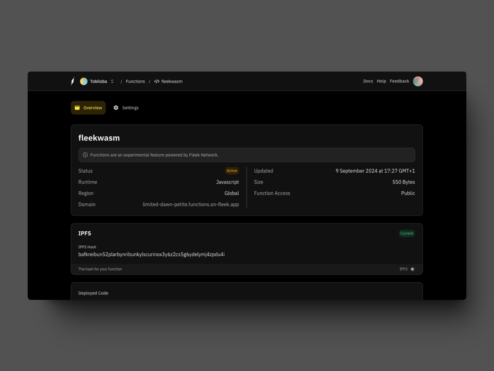

# Building secure decentralized applications: deploying and running WASM code with Fleek Functions and Edge SGX

With the recent integration of Intel SGX (Software Guard Extensions) into Fleek’s decentralized platform, building secure and privacy-focused applications has never been easier. Fleek’s [Edge SGX service](https://fleek.xyz/blog/announcements/introducing-fleek-edge-sgx/), currently in alpha, allows developers to leverage Trusted Execution Environments (TEEs) for private, edge-optimized, and secure compute powered by [Fleek Network](https://blog.fleek.network/post/fleek-network-intel-sgx-integration/).

In this guide, we’ll explore how you can combine Fleek Functions with the Edge SGX service to create powerful, decentralized apps. Fleek Functions are serverless, edge-optimized functions that make it simple to run programs globally across Fleek’s network. By integrating them with Edge SGX, you can build apps that are not only fast but also secure, with computation happening in a fully encrypted, trusted environment.

Whether you’re aiming to enhance data privacy, protect sensitive computations, or simply explore new ways to decentralize your applications, this guide will help you get up and running with Fleek Functions and Edge SGX.

Let’s dive in!

---

## **Prerequisites**

As stated above, to use the new SGX integration we need to have our code compiled to [WASM (Web Assembly)](https://webassembly.org/getting-started/developers-guide/). Wasm can be compiled to from C, C++, Rust. We have an example function written in Rust that we will compile to wasm to show this integration.

The purpose of this guide is to walk you through the process of compiling your code to WASM, deploying it to Fleek with the SGX integration and decrypting it by making a call to the deployed function from a Fleek Function with the required parameters.

Before we get into setting things up, you need to have the following:

1. An account on [app.fleek.xyz](http://app.fleek.xyz/)
2. [Fleek CLI](https://fleek.xyz/docs/cli/)
3. [Sgxkit](https://github.com/fleek-network/lightning/tree/sgx-alpha/lib/sgxkit)
4. [Rust](https://www.rust-lang.org/tools/install)
5. Code editor of your choice

The SGX integration is available on the Fleek CLI version 2.10.0. To install the Fleek CLI on your machine, run:

```bash
npm i -g @fleek-platform/cli
```

You can confirm your Fleek CLI version by running:

```bash
fleek version
```

Then login into your Fleek account from your Fleek CLI with the command:

```bash
fleek login
```

Finish off by following the generated link to grant access to your account.

---

## **Setup**

1. Start by creating a directory and initializing a Rust project:

```bash
mkdir fleek-sgx-example-hello
cd fleek-sgx-example-hello
cargo init
```

2. Our directory should look like below:

```bash
txt
fleek-sgx-example-hello
├── src
│   └── main.rs
└── Cargo.toml
```

3. Edit your `Cargo.toml` to use the git dependency for Sgxkit and it should look like below:

```bash
[package]
name = "fleek-sgx-example-hello"
version = "0.0.0"
edition = "2021"

[dependencies]
sgxkit = { git = "https://github.com/fleek-network/lightning", rev = "21542ac506c6cb8c281d6428f25055d5a8ce8b7e" }

[profile.release]
lto = "fat"
codegen-units = 1
```

The Sgxkit library will be released on [crates.io](http://crates.io/) very soon for public usage.

4. Install the package for the wasm bindings supported by the Fleek Edge SGX integration

```bash
rustup target add wasm32-unknown-unknown
```

## **Compiling to WASM**

In your `main.rs` file, paste the below code:

```bash
use std::io::Write;

use sgxkit::io::OutputWriter;

fn main() {
    let mut writer = OutputWriter::new();
    writer
        .write_all(b"Hello, world! From, SGX WASM <3\\n")
        .unwrap();
}
```

Build the `main.rs` example using custom-made bindings and encodings that are compatible with the SGX integration on Fleek Network:

```bash
cargo build -r --target wasm32-unknown-unknown
```

The above command compiles the `fleek-sgx-example-hello` binary from the Rust into a WebAssembly (`.wasm`) file, optimized for release. It targets the WebAssembly format (`wasm32-unknown-unknown`), and the output is stored in the `target/wasm32-unknown-unknown/release/` directory. We will then deploy the `wasm` file from that directory and while deploying we will see the file binary being encrypted.

If the above command fails with a permissions error on UNIX-based systems like MacOS or Linux, try it with a `sudo` prefix:

```bash
sudo cargo build -r --target wasm32-unknown-unknown
```

## **Encrypt and upload WASM**

We have to upload the wasm generated to be stored on the Fleek Network so we can call it, decrypt it, and use it via an IPFS URL.

Start by creating the Fleek Function first:

```bash
fleek functions create --name fleekwasm
```

Encryption and upload happen at a go by just running the command below:

```bash
fleek functions deploy --name fleekwasm --path target/wasm32-unknown-unknown/release/fleek-sgx-example-hello.wasm --sgx
```

You should see something similar after deploying successfully:

```bash
fleek functions deploy --name fleekwasm --path target/wasm32-unknown-unknown/release/fleek-sgx-example-hello.wasm --sgx

You should see something similar after deploying successfully:

Encrypting code: [████████████████████████████████████████] 100% | ETA: 0s | 100/100

Uploading code to IPFS: [████████████████████████████████████████] 100% | ETA: 0s | 342/342

✅ Success! The deployment has been successfully created.

> You can call this Fleek Function by making a request to the following URL

🔗 <https://limited-dawn-petite.functions.on-fleek.app>

> You can also call this Fleek Network URL directly for increased performance (please keep in mind you will not be able to deactivate this link)

🔗 <https://fleek-test.network/services/3>

🔗 Blake3 Hash: 86d4dc28e4c2afcca3090fa55bf94fbd341ab999dd938768fc07dca875533d05

🔗 Invoke by sending request to <https://fleek-test.network/services/3> with payload of {hash: <Blake3Hash>, decrypt: true, inputs: "foo"}

🔗 Example: curl fleek-test.network/services/3 --data '{"hash": "86d4dc28e4c2afcca3090fa55bf94fbd341ab999dd938768fc07dca875533d05", "decrypt": true, "input": "foo"}'
```

## **Deploying the Fleek Function**

Now we will be using a JavaScript function to interact with the “hello world” example we encrypted and uploaded above, by making an IPFS request and running some tasks that will then give us a response with the string and an object with some information like the signature and more.

This stage only involves 3 steps.

1. Go to the Functions tab to obtain the IPFS hash. We will add this to the IPFS URL to fetch the `wasm` file hash.



The IPFS URL as in:

```bash
ipfs://bafkreibun52plarbynribunkylscurinox3y6z2cs5g6ydelymj4zpdu4i
```

2. Use the below task runner written in JavaScript that calls runtime APIs to interact with SGX exposed by Fleek’s runtime APIs in production:

```bash
export const main = async () => {
  const wasmHash =
    await Fleek.fetchFromOrigin("ipfs://bafkreibun52plarbynribunkylscurinox3y6z2cs5g6ydelymj4zpdu4i")
      .then(bytes => Array.from(bytes).map(v => v.toString(16).padStart(2, '0')).join('')); // convert to hex string

  const request = {
    hash: wasmHash,
    decrypt: true,
  };

  // Run the task locally
  const { responses } = await Fleek.runTask(Fleek.ServiceId.Sgx, request);

  if (responses.length == 0) {
    return "error: failed to run sgx task";
  } else {
	  // Return the SGX response bytes directly
    return new Uint8Array(responses[0])
  }
}
```

- The code fetches a WebAssembly file from IPFS.
- Converts it to a hexadecimal string.
- Sends a request with this hash to Fleek’s SGX service
- If successful, it returns the first result from the SGX task as a `Uint8Array`, otherwise, it returns an error message.

3. Then you create the Fleek Function:

```bash
fleek functions create --name sgx-fleek
```

4. The final step is to deploy the Fleek Function and to do that, run the below command:

```bash
fleek functions deploy --name sgx-fleek --path index.js
```

Follow the subsequent instructions by choosing your project on your Fleek account and then the Fleek Function deploys. You should see the below in your terminal:

```bash
Bundling code: [████████████████████████████████████████] 100% | ETA: 0s | 100/100

✅ Success! The deployment has been successfully created.

> You can call this Fleek Function by making a request to the following URL

🔗 https://limited-dawn-petite.functions.on-fleek.app

> You can also call this Fleek Network URL directly for increased performance (please keep in mind you will not be able to deactivate this link)

🔗 https://fleek-test.network/services/1/ipfs/bafkreibkpoqepzjyeti5evpcg4kl36poeflewxdonb2bwhxb4x3axumtbi
```

You can access the Fleek Function by going to the Fleek Function URL [here](https://limited-dawn-petite.functions.on-fleek.app/).

When you visit the URL, you should see the below on your browser:

```bash
{"hash":"eac455244d7970f5428070c1f28d144c2e5033689de98b1b826b5b4eb6a38a14","tree":"eac455244d7970f5428070c1f28d144c2e5033689de98b1b826b5b4eb6a38a14","signature":"3cf56fe96dcbd1e77c77e6867958a8d8e22cac3c310f1670288403950840f53109e26ef284db7edc3453b316e6d20fb2cf5873f601d96e5badc6e88d3d4b5f0201"}
Hello, world! From, SGX WASM <3
```

---

Combining Intel SGX with [Fleek Functions](https://fleek.xyz/blog/announcements/introducing-fleek-functions/) empowers developers to build highly secure, privacy-first decentralized applications. With Trusted Execution Environments (TEEs), you can ensure that sensitive computations, environment variables, and data are encrypted and fully protected, even from the nodes running them. This extra layer of security makes Edge SGX the perfect solution for privacy-focused apps in a decentralized world.

As Fleek’s SGX service progresses beyond its alpha phase, it will unlock even more possibilities for developers looking to build secure, verifiable, and scalable applications. This evolution continues to solidify Fleek’s position as a go-to cloud platform for decentralized, open-source, and privacy-first development.

Join our Discord today and connect with 50,000+ developers already building on Fleek.
