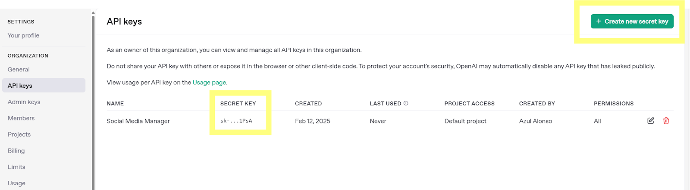
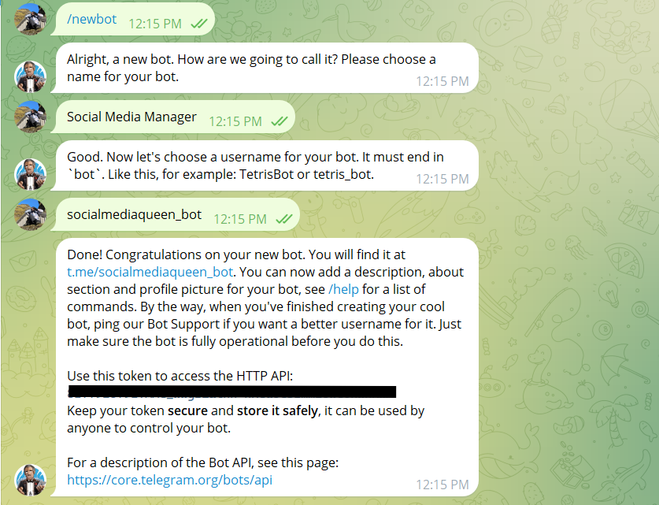
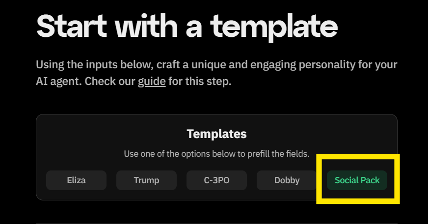
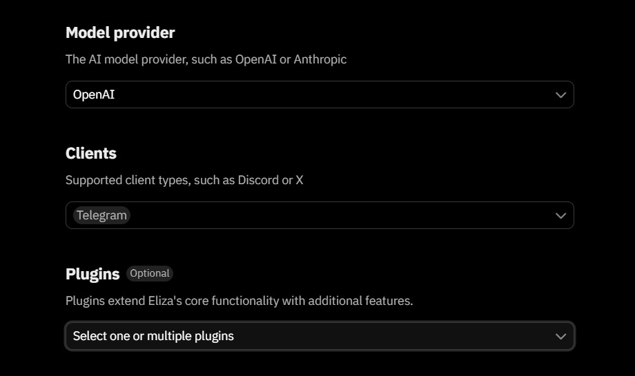
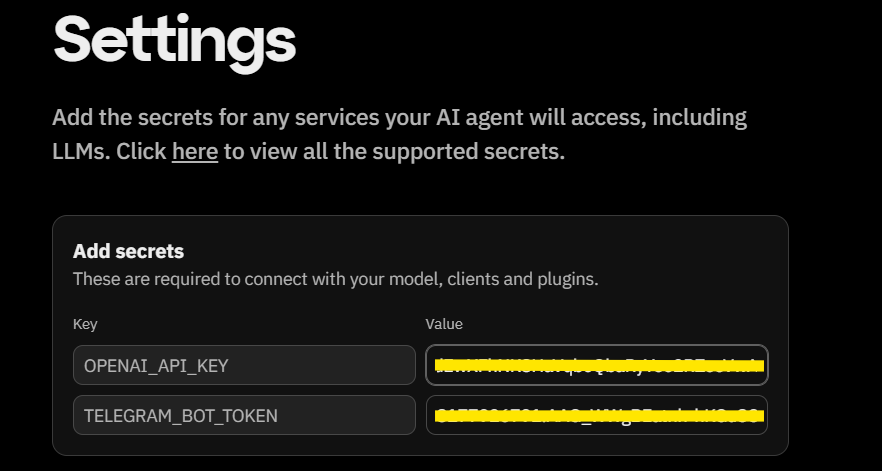
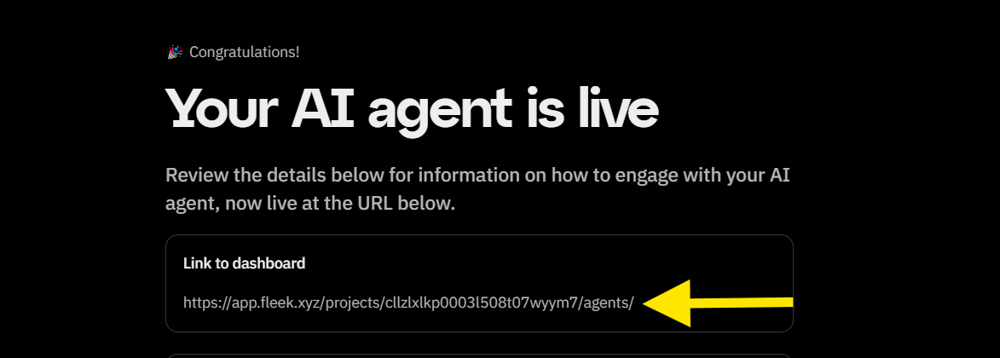
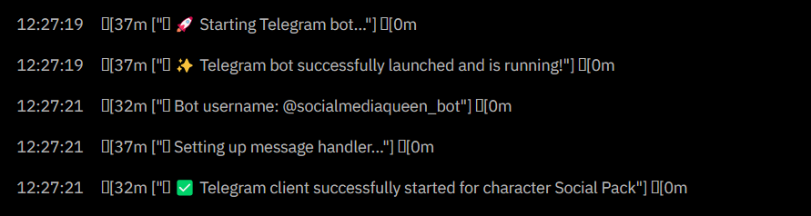
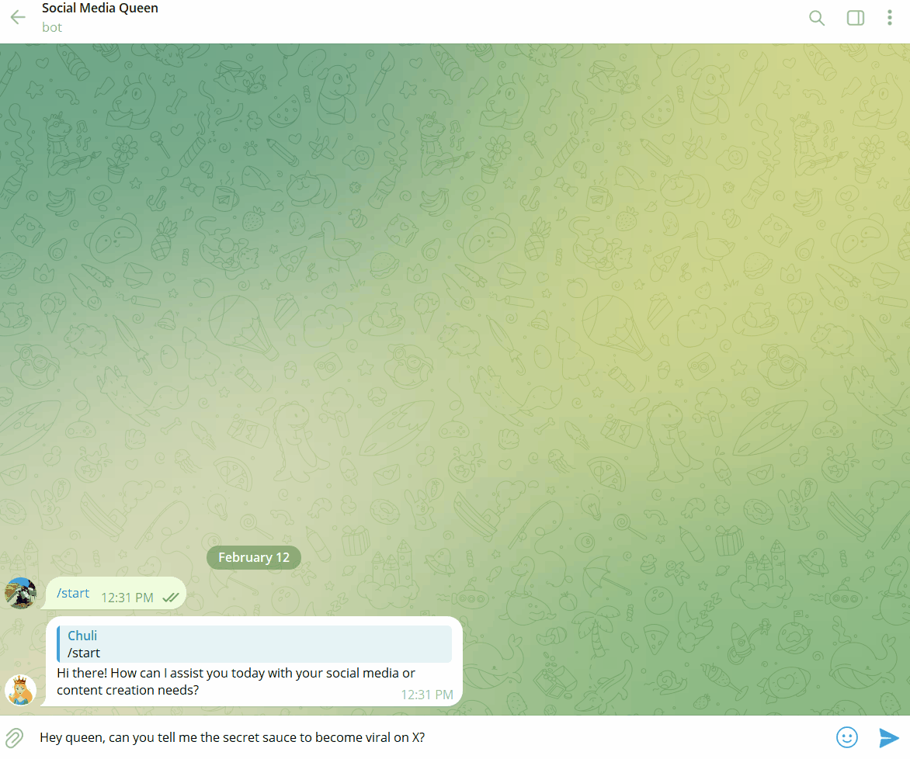

Social media chatbots are revolutionizing online engagement, helping brands, creators, and businesses **automate conversations, interact with followers, and provide instant responses**. With **OpenAI and Fleek**, you can create your own **AI-powered social media assistant** that seamlessly integrates with Telegram, responding to messages, answering questions, and keeping your community engaged—24/7.

Fleek makes this process **fast and effortless** by offering a **pre-made Social Pack template**, eliminating the need for complex coding or infrastructure setup. Whether you’re building a **Telegram bot for customer support, automated FAQs, or interactive social engagement**, this guide will show you how to **customize and deploy your AI assistant in just a few clicks**.

---

## **Overview of What We'll Build**

We’ll be creating a **social media AI agent** that runs on Telegram, designed for **engaging with audiences, responding to users, and automating interactions**. Using Fleek’s **Social Pack template**, you’ll be able to:

✅ **Customize your AI’s personality** – Set a name, bio, and conversation style to match your brand or persona.

✅ **Use OpenAI to power responses** – Leverage one of the most advanced AI models for intelligent replies.

✅ **Deploy instantly to Telegram** – Let your AI chat with users in real time, just like a human assistant.

✅ **Automation for social media** – Create an AI agent that interacts with followers, answers common questions, or even posts updates.

✅ **Choose between basic or advanced features** – Keep it simple or integrate plugins for added functionality.

✅ **Get it live in minutes** – No coding, no infrastructure, just a few clicks.

This guide is perfect for **content creators, community managers, businesses, and developers** looking to build a **Telegram chatbot** that enhances their social media engagement.

Now, let’s get started! 🚀

---

## **Step 1: Get Your OpenAI API Key**

To power your AI agent, you’ll need an **OpenAI API key**. Here’s how to get one:

1. **Go to the OpenAI platform** → https://platform.openai.com/signup
2. **Sign up or log in** → If you don’t have an account, create one.
3. **Navigate to the API Keys section** → Found in your account settings.
4. **Generate a new API key** → Click "Create API Key" and **copy** the key.
5. **Store it securely** → You’ll need this key in later steps.

💡 **Tip:** Never share your API key publicly, as it grants access to your OpenAI usage.

---

## **Step 2: Set Up Telegram Bot Credentials**

Your AI agent needs a **Telegram Bot Token** to function. Follow these steps to generate one:

1. **Open Telegram** and search for [**BotFather**](https://t.me/BotFather) (the official Telegram bot for managing bots).
2. **Start a chat** with BotFather and send the command: /newbot
3. **Follow the setup prompts** → Provide a name and username for your bot.
4. **Copy the bot token** provided by BotFather.

You’ll need this token when deploying your agent on Fleek.

💡 **Tip:** Never share your API key publicly

---

## **Step 3: Customize Your AI Agent’s Personality**

Now that we have our API keys, it’s time to **personalize your AI agent** and configure it to work on Telegram.

1. **Go to [fleek.xyz/eliza/](https://fleek.xyz/eliza/)**
2. Click **"Start with a Template."**
3. **Choose the "Social Pack" Template**
   - This template is designed for **social media chatbots**, making it the best choice for a Telegram AI agent.
4. **Select OpenAI as the Model Provider**
   - Toggle **OpenAI** as your AI model provider.
5. **Select Telegram as the Client**
   - Choose **Telegram** as the platform where your bot will operate.

---

### **Plugins: Keep Them or Disable Them?**

- **For Beginners:**
  - **Unselect all plugins** to keep the bot **simple** and focused on being a social media chat assistant.
  - This is the easiest way to **quickly deploy** a chatbot without any extra setup.
- **For Advanced Users:**
  - You can **keep plugins enabled** for additional functionality, like enhanced API integrations.
  - Some plugins **require additional API keys** (e.g., retrieval plugins, external API calls).
  - Be aware that **some third-party plugins may have additional costs** depending on the service.

Once you’ve **selected OpenAI, Telegram, and configured your plugins**, your AI agent is ready for deployment! 🎉

---

## **Step 4: Deploy on Fleek**

Now, let’s get your AI bot live!

1. **Go to the Fleek Deployment Settings**
2. **Enter Your API Keys**

   In the **“Add Secrets”** section, fill in:

   - **OPENAI_API_KEY** → Paste the API key from OpenAI.
   - **TELEGRAM_BOT_TOKEN** → Enter the Telegram bot token from BotFather.

3. **Review Your Character**
   - Click **"Review Character"** to confirm all your settings.
4. **Click "Deploy Agent"**
   - This will deploy your AI agent instantly on Fleek

---

### **Step 5: Start Chatting on Telegram!**

Once your AI agent is live, **your Telegram bot will be ready to use automatically**—all you need to do is activate it!

### **How to Test Your Bot:**

1. **Visit the Dashboard and View Logs**
   - Click **View Logs**.
   - Refresh the logs to ensure everything is up to date.

2. **Go back to telegram**
   - Open the link provided by Telegram.
   - Click **Start** to activate your bot.

3. **Start Chatting!**
   - Send a message—your AI should now respond instantly using OpenAI! 🎉

4. **Customize Your Bot (Optional)**
   - You can now add a **description, about section, and profile picture** to make your bot more personalized.
   - Type **/help** in BotFather the chat to see available commands.
   - If you want a better bot username, you can contact **Telegram Bot Support**, but make sure your bot is fully operational first.

---

## **The 3-Minute Challenge**

Now that you’ve built your AI agent, we challenge you to **deploy it in under 3 minutes**!

1. Follow the steps outlined in this guide.
2. Time yourself and see how fast you can launch your bot.
3. Once your bot is live, **post your results on [X](https://x.com/fleek)** and tag Fleek!

With Fleek and OpenAI, deploying AI agents has never been easier. **Ready, set, deploy! 🚀**

---

### **Want to Deploy AI Even Faster?**

Explore more **templates** on [Fleek Eliza](https://fleek.xyz/eliza/) and launch your next AI project in seconds.

---
