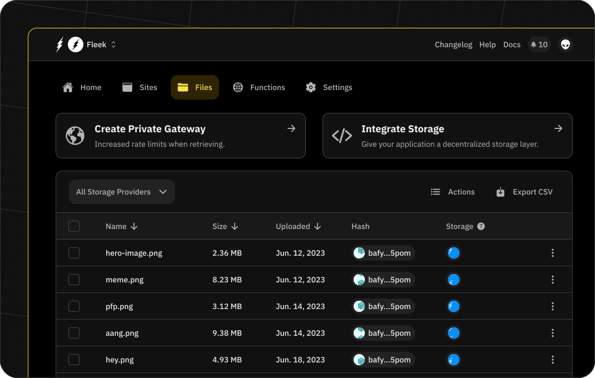

# Storage on Fleek

Fleek's storage service enables the decentralized storage of your files.

## Supported services

We support the following storage protocols:

- IPFS
- Arweave
- Filecoin

To guarantee the best performance and availability, we use a combination of these protocols. We use IPFS as the main storage protocol and we use Arweave and Filecoin as a backup layer. This allows us to provide a high availability and performance service. By default, we are using Filecoin as the backup layer, but the configuration can be changed in the storage settings for your project.

Storage is a service unique for every project. This means that you can have different storage configurations for each of your projects in Fleek.

:::warn
Daily file upload limit: 150 files (2GB) every 24 hours. Contact Support for higher quotas. Files over 100KB won't be stored on Arweave, even if enabled.
:::

## Add a file or directory

:::info
We are aware that there is a bug in the UI for some users using Firefox and Linux that prevents the upload dialog box from appearing. We are investigating this issue in the meantime, if you are experiencing this issue, please attempt this operation with another browser.
:::

### Adding a File

1. Navigate to the Files section in your project dashboard.
2. Click on the Upload File button.
3. A modal will open where you can select one or multiple files to upload.
4. The file(s) will be uploaded to IPFS. In the background, they will be uploaded to Filecoin and/or Arweave, depending on your configuration.

### Adding a Directory

1. Navigate to the Files section in your project dashboard.
2. Click on the Upload Directory button.
3. Select the directory you want to upload.
4. The directory will be uploaded and stored on IPFS and decentralized storage (Filecoin/Arweave).

## Accessing a file or directory

1. Locate the file or directory in the Files section.
2. Click on the three-dot icon in the row corresponding to the file or directory.
3. Select the Copy URL option. This will copy the URL to your clipboard, enabling you to access the file or directory via IPFS gateways.
4. Optionally, you can set up a custom domain for a more performant and branded experience by following the steps in the [Gateways](/docs/cli/gateways/) section of the documentation.

## Deleting a file or directory

1. Locate the file or directory in the Files section.
2. Click on the three-dot icon in the row of the file or directory.
3. Select the Delete option. This will remove the file or directory from your storage. Note: This action is irreversible.

## Content addressing

All files stored on Fleek are content-addressable using IPFS. Each file will receive a unique, immutable IPFS content hash, making it addressable in a standard web3 format.

- Example IPFS hash: QmX4XRaPP6jBSDiYr3tK7fEBWSA5QURS8WZ87ZvPRJgAqK
- Files can be accessed through Fleek's gateways or a public gateway like `ipfs.io/ipfs/<yourhash>`.

For dynamically changing content, you can use IPNS to map dynamic IPFS hashes to a static record. See the [CLI](/docs/cli) or [SDK](/docs/sdk/) sections for more information on managing IPNS records.
