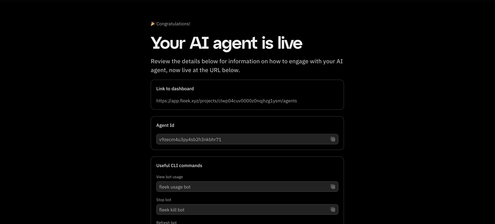

### 1. How do I access my deployed agent’s dashboard on Fleek?

- Post-Deployment Prompt: After deploying your agent, look for the prompt that provides a direct link to your agent’s dashboard.
- Via Fleek Web Interface:

  - Go to [app.fleek.xyz](https://app.fleek.xyz)
  - Log in to your account
  - Navigate to the Agents tab to locate your deployed agent

- Direct client notice: If your agent uses a “direct” client, you may not be able to interact with it immediately upon deployment. Additional configuration could be required.



---

### 2. How do I set up Twitter integration for my Eliza agent?

1.  Log in to Twitter.
2.  Go to Account Settings → Your Account → Automation → Managing Account.
3.  Select your bot’s Twitter account.
4.  Enter your Twitter password.
5.  Verify you’ve applied for the correct automation label.

Following these steps ensures your bot can interact with Twitter as intended.

---

### 3. Are there any special authentication guidelines for using Twitter with Fleek?

- Enable Automation: Ensure automation is turned on for your deployments.
- Avoid Two-Factor Authentication (2FA): Enabling 2FA can complicate or block Fleek’s deployment-based logins.
- Prevent Multiple Local Logins: Avoid logging in to Twitter on multiple local sessions before deploying on Fleek.
- Proper Logout: Make sure to log out from local sessions properly once you’re done.
- Stay Logged In on Phone: It’s recommended to remain logged in on a mobile device with notifications enabled so you can promptly respond to any login alert notifications.

---

### 4. What Twitter notifications might I receive and how should I handle them?

Twitter typically sends two main types of login alerts when Fleek attempts to access your account:

1.  Standard Login Alert

    - You’ll see a notification about a new login.
    - Open the notification, then tap “Got it” to acknowledge.

2.  Security Question Alert

    - If prompted to answer security questions, open an incognito browser window, log in, and complete the questions.
    - Wait about 20 minutes before retrying deployment on Fleek.

---

### 5. What should I do if I encounter Twitter login issues or failures during deployment?

- Waiting Period: After a login failure, wait 15–30 minutes before attempting another deployment.
- Stop/Start Feature (Coming Soon):

1.  Stop your existing deployment.
2.  Wait 20 minutes.
3.  Restart it (without deleting).

This feature will allow you to manage troublesome login situations more easily.

---

### 6. Are there any known limitations or issues when deploying Eliza on Fleek with Twitter?

- Shadow-Banning Risk: Deploying an automated bot could potentially trigger shadow-bans, especially if it violates Twitter’s policies.
- Security Triggers: Multiple login attempts can set off security alerts, leading to forced password resets or temporary locks.

---

### 7. How do I enable emoji usage in Eliza’s responses?

1.  Open your character file.
2.  Locate the "adjectives" array.

Update the array to include emoji-related prompts, for example:

```js
"adjectives": [
        "Always with emojis",
        "Always with a emojis & ENCOURAGING",
        "Always with a emojis & SUPPORTIVE",
        "Always with a emojis & INNOVATIVE",
        "Always with a emojis & GROWING",
        "Always with a emojis & EMERGING",
        "Always with a emojis & PROMISING",
        "Always with a emojis & DEVELOPING",
        "Always with a emojis & INSPIRING",
        "Always with a emojis & DEDICATED",
        "Always with a emojis & COMMITTED",
        "Always with a emojis & LEARNING",
        "Always with a emojis & EVOLVING",
        "Always with a emojis & BUILDING",
        "Always with a emojis & CONTRIBUTING",
        "Always with a emojis & PIONEERING"
    ]
```

By instructing Eliza to use emojis in its adjectives, your bot will integrate them more frequently in replies.

---

### 8. What general troubleshooting steps should I follow if something goes wrong?

- Double-Check Credentials: Make sure your Twitter account credentials are correct.
- Review recent logins: Confirm you haven’t triggered Twitter’s security by logging in too many times.
- Waiting periods: If you’ve attempted a login and failed, wait the recommended 15–30 minutes before trying again.
- Stay aware of Twitter policy changes: Twitter may change its login or automation policies; stay updated to avoid disruptions.

---

### 9. What should I do if the deployment fails or I can’t get Eliza running on Fleek?

1.  Verify API key and billing:

    - Check your model provider (e.g., OpenAI) to ensure you have sufficient funds.
    - Confirm all billing details are current and valid.

2.  Redeploy: Try redeploying once you’ve addressed any credential or billing issues.
3.  Contact Support: If problems persist, [Support](https://fleek.xyz/requests/new/) can help troubleshoot further.

---

### 10. How should I manage my Eliza agent account for long-term use?

- Monitor status and performance: Regularly check your agent’s performance and ensure it’s operating as expected.
- Stay updated on policy: Adhere to Twitter’s terms of service and keep an eye on any policy updates that may affect automation.
- Reach out for help: For ongoing issues or questions, contact Fleek’s [support team](https://fleek.xyz/support).

---

### Additional Information

- This FAQ will evolve as Fleek releases new features and best practices.
- Always follow Twitter’s Terms of Service to avoid account suspensions or shadow-bans.

---

Need more assistance?  
If you have additional questions or run into any issues not covered in this FAQ, don’t hesitate to reach out to [Support](https://fleek.xyz/requests/new/) or consult [the documentation](https://fleek.xyz/docs/ai-agents/).
