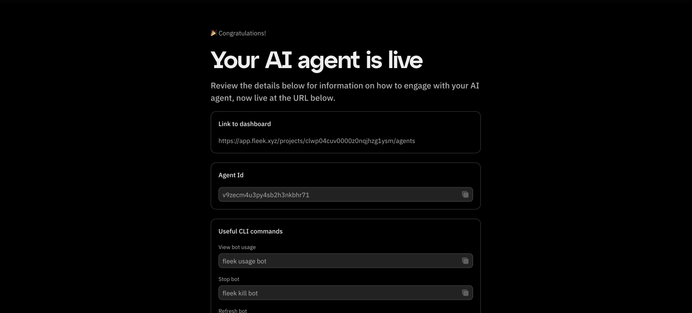

Whether you’ve just deployed your Eliza agent or you’re encountering issues, here’s a quick guide to help you move forward:

---

1. **Access Your Agent Dashboard**

   - **Post-deployment prompt:** After you deploy your agent, you should see a prompt to view it on the dashboard.

   - **Via Fleek:** If you miss the prompt, simply go to [app.fleek.xyz](https://app.fleek.xyz), login, and navigate to the Agents tab to see your deployed agents.

   

---

2. **“Direct” Client Considerations**

   - **Limited interactivity:** If your agent uses a direct client, you may not be able to interact with it immediately.

   - **Ongoing enhancements:** We’re currently working on providing interfaces and APIs for direct clients, so stay tuned for updates.

---

3. **Troubleshooting Twitter Integration**

If you’re using Twitter and your agent isn’t logging in, follow these steps:

- Log in to your Twitter account.
- Go to Account Settings.
- Select Your Account.
- Choose Automation.
- Click Managing Account.
- Select the account that runs your bot.
- Enter your password.
- Confirm that the label has been applied.

---

4.  **Deployment Issues**


If you encounter a screen indicating a deployment issue, try the following:

- **Check API Key and Billing:** Ensure the API key used for your model provider (e.g., OpenAI) has sufficient funds. Confirm your billing details are up to date.

- **Retry Deployment:** Attempt to redeploy your agent.

- **Reach Out to Support:** If the issue persists, contact our [support team](https://fleek.xyz/support/) for assistance.

---

5. **Emojis**

If you want your agent to use emojis in the responses, you have to specifically include it in the “adjectives” array, inside the character file, like so.

```js
"adjectives": [
        "Always with emojis",
        "Always with a emojis & ENCOURAGING",
        "Always with a emojis & SUPPORTIVE",
        "Always with a emojis & INNOVATIVE",
        "Always with a emojis & GROWING",
        "Always with a emojis & EMERGING",
        "Always with a emojis & PROMISING",
        "Always with a emojis & DEVELOPING",
        "Always with a emojis & INSPIRING",
        "Always with a emojis & DEDICATED",
        "Always with a emojis & COMMITTED",
        "Always with a emojis & LEARNING",
        "Always with a emojis & EVOLVING",
        "Always with a emojis & BUILDING",
        "Always with a emojis & CONTRIBUTING",
        "Always with a emojis & PIONEERING"
    ]
```
