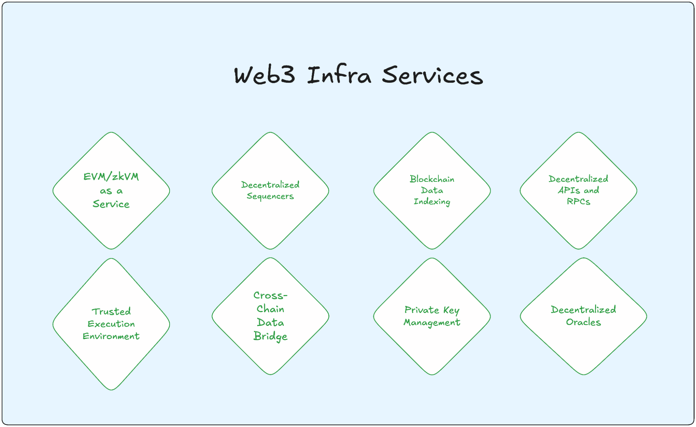

Decentralization, the central thesis of web3, can be seen in action with decentralized social media, governance platforms, financial markets/trading platforms, and more. Yet each _decentralized_ application still relies on centralized infrastructure at some layer of their stack, meaning they’re only one outage or corporate decision away from going dark.

With more businesses and services going digital, the need for trustless, verifiable, and censorship-resistant web services has never been more critical.

Fleek Network is engineered to serve this exact need where developers can build and run any web service they can imagine, powered by a decentralized network of edge nodes. _No DevOps headaches. No vendor lock-in. Just pure, performant, permissionless infrastructure._

The goal is simple: **_Build permissionless and verifiable infra that developers use to achieve web-grade performance in a decentralized setting._**

In the pursuit of this goal, we are closing in on a comprehensive suite of services, from trustless hosting, compute, CDN, DNS, and global deployments. All of these running on a decentralized edge network canvas means we are pushing the boundaries of what’s possible. _Fleek already leverages several Fleek Network services and use cases, and there are tons more developers can build._

**_In this resource, we present 50 practical examples of web services possible with Fleek Network being the foundational stack. Honestly, we are just scratching the surface._**

---

## **Web Infra & Cloud Services**

Web infrastructure and cloud services are the backbone of today’s internet, enabling everything from content delivery to data processing at scale.

However, traditional, centralized infrastructure introduces risks like vendor lock-in, downtime from single points of failure, and corporate control over data access. And Fleek Network provides a decentralized canvas for these core services to be built with high performance while not sacrificing control, privacy, or availability.

This section will explore the following web infra & cloud services: **_decentralized CDNs, edge caching, image optimization, decentralized API gateways, and real-time WebSocket connections._**

1. ### **Decentralized CDN**

A decentralized CDN on Fleek Network can potentially power Netflix using the network's geo-aware, edge-optimized nodes for ultra-low latency. With over 3000 nodes and [verified bandwidth](https://blog.fleek.network/post/content-addressing-verifiability-blake3/), Fleek can ensure a trustless data delivery along with in-built distributed caching across the globe.

2. ### **Image processing/optimization**

Developers can deploy image processing and optimization tasks directly on the edge using Fleek Network's [JavaScript runtime environment](https://blog.fleek.network/post/fleek-network-developer-guide-js-runtime/) and edge functions. By running serverless functions near users, Fleek reduces latency and delivers optimized media faster.

The service can then be combined with Fleek's CDN for optimized delivery, while [Intel SGX integration](https://blog.fleek.network/post/fleek-network-intel-sgx-integration/) can enable secure watermarking and private image transformations through TEEs — trusted execution environments.

3. ### **Static site hosting**

Fleek offers decentralized static site hosting, storing assets on [decentralized storage](https://fleek.xyz/blog/learn/understanding-ipfs-storage-fleek/) protocols (IPFS, Filecoin, Arweave).

This coupled with Fleek Network’s gateway means seamless, high-speed access to globally stored and secured data. Sites benefit from automatic cache distribution across Fleek's global edge network, while service workers can enable direct node connections for faster subsequent loads.

The storage protocols — [IPFS](https://ipfs.tech/), [Arweave](http://arweave.org/), [Filecoin](http://filecoin.io/) — ensures data availability without centralized control.

[Fleek Platform](http://fleek.xyz/) also simplifies deployment, scaling, and ongoing management, making it a strong alternative to traditional static site hosting on centralized servers.

4. ### **Minify JavaScript/CSS**

Minifying assets like JavaScript and Cascading style sheets (CSS) helps improve load times — a task Fleek Network can optimize through its edge functions. It can also handle real-time distribution courtesy of the network's CDN capabilities.

Additionally, Fleek’s ability to host these tasks at the edge ensures users access minified, high-performance assets quickly with reduced bandwidth consumption.

5. ### **Edge caching system**

Fleek Network powers real-time caching using its geo-optimized nodes and content addressing. Fleek also employs [Blake3 hashing](https://blog.fleek.network/post/fleek-network-blake3-case-study/) for deterministic verification of cached content. Applications and web services requiring high availability can use Fleek Network’s intelligent routing and caching protocols to reduce load times.

6. ### **Decentralized API gateways**

Decentralized API gateways built on Fleek Network can be a super interesting tooling with verified bandwidth and optimized routing. The edge-optimized infra also means these API gateways can operate in the most remotest of the locations, yet deliver high-availability connections with minimal latency.

7. ### **Realtime WebSocket connections**

Fleek Network can support WebSocket connections facilitating low-latency and real-time communication through its edge nodes.

Fleek leverages protocols like WebRTC and WebTransport, bypassing centralized points while maintaining secure peer-to-peer connections. The network's [optimistic payment processing](https://blog.fleek.network/post/fleek-network-web-service-grade-performance/) enables sustained real-time connections without transaction overhead, perfect for chat applications or live data streams.

---

## **Edge Computing**

Edge Computing enables low-latency, high-performance computation by processing data closer to users. Fleek Network’s decentralized edge infrastructure makes serverless functions, real-time processing, and dynamic request handling scalable and resilient without the need for centralized cloud providers.

1. ### **Serverless functions**

Fleek’s decentralized, edge-optimized serverless functions allow developers to deploy code that runs near users. The JS runtime environment coupled with content-addressing by Blake3 hashing enables serverless function execution at the network edge without having to build or manage infra.

The network's edge nodes ensure low-latency, high-throughput performance, ideal for applications needing fast computation or frequent user interaction.

2. ### **API request handling**

Developers can employ Fleek Network to enable API request handling at the edge. Using Fleek's handshake component and geo-aware nodes, API requests can be automatically routed to the optimal node based on proximity and reputation.

Using these, developers can achieve improved request resolution times, high availability, and trustless interactions which are crucial for web services and applications with a global user base.

3. ### **Edge SSR**

Fleek Network’s support for edge server-side rendering (SSR) enables dynamic content to be processed near users.

This reduces time-to-first-byte and improves page load speeds as compared to traditional cloud providers. Fleek’s infrastructure ensures SSR tasks leverage decentralized nodes, allowing applications like Next.js to perform optimally with reduced reliance on central servers.

Learn more: [A Beginners Guide to How Server-Side Rendering (SSR) Works](https://fleek.xyz/blog/learn/server-side-rendering-explained/)

4. ### **Real-time logging**

Real-time logging on Fleek allows developers to monitor events and application metrics across decentralized nodes in real-time. Fleek Network also can provide verifiable and decentralized access to system performance and event tracking data, enabling faster insights and troubleshooting.

5. ### **User authentication/authorization**

Developers can build edge-based user authentication and authorization on Fleek's edge infrastructure.

The network's geographic distribution ensures low-latency auth requests, while the reputation system helps maintain service reliability. On top of it, the network's integration with Intel SGX can help further authentication measures with secure credential management and private key operations.

6. ### **Failover management**

Fleek Network's decentralized nature provides inherent failover capabilities through its distributed node network.

The platform's reputation system and intelligent routing automatically redirect traffic when node performance degrades or is compromised. This decentralized failover mechanism protects applications from outages, while content addressing and the blockstore maintain data consistency during failovers.

---

## **Web3 Infra Services**

Web3 infrastructure often relies on centralized providers, creating points of failure in otherwise decentralized solutions. Fleek Network's edge-optimized platform can provide the foundation for truly decentralized Web3 infrastructure services, enhancing security and reliability.

1. ### **EVM, zkVM as a service**

Fleek Network can serve as an ideal platform for running VMs at the edge. Unlike traditional VM-bound networks, Fleek's VM-less core enables more efficient resource utilization when running EVM or zkVM services. Combined with geographic distribution and intelligent routing, these VMs can achieve lower latency than centralized alternatives while maintaining true decentralization and leveraging optimistic payment processing for high throughput.

2. ### **Decentralized sequencers**

Sequencers play a vital role in rollup and layer 2 networks by ordering transactions off-chain before submitting them to the main chain. Fleek Network’s edge nodes can help sequencers be more performant and secure. Geographic distribution of nodes can help prevent sequencer censorship and reduce latency.

3. ### **Blockchain data indexing**

Indexing services can utilize Fleek Network's distributed edge nodes to process and cache blockchain data closer to users.

The network's content addressing and Blake3 hashing can ensure data integrity, while the blockstore enables efficient caching of indexed data. BGP-optimized routing ensures faster data delivery, making indexing services more responsive than centralized alternatives.

4. ### **Decentralized API/RPC**

Fleek Network can offer decentralized RPC endpoints, allowing applications to query blockchain data in a trustless environment. These RPCs and APIs can be distributed across Fleek's edge network, eliminating single points of failure common in centralized RPC providers.

The platform's handshake component can secure connections, while Intel SGX integration can enable private RPC operations. Geographic awareness and reputation-based routing can ensure requests are served by the most reliable and closest nodes.

5. ### **Trusted execution environments (TEEs)**

With Intel SGX integration, Fleek Network can provide secure TEEs for confidential computing at the edge.

The platform supports WASM in the execution environment, with enclave-to-enclave remote attestations ensuring security. This can enable private smart contract execution, confidential data processing, and secure multi-party computation closer to users within isolated and verifiable enclaves.

6. ### **Cross-chain data bridge**

Bridge services can utilize Fleek's edge nodes for faster cross-chain data verification and transfer. The Intel SGX integration can secure private keys and sensitive bridge operations, while the network's geographic distribution can improve bridge reliability.

Optimistic payment processing can enable efficient handling of high-volume bridge transactions.

7. ### **Private key management**

Fleek's Intel SGX integration can provide secure key management services at the edge.

The platform's remote attestation capabilities can ensure key operations occur only within isolated and verified enclaves. This setup protects private keys from exposure and unauthorized access, addressing a critical security requirement for dApps handling sensitive user data and transactions.

On top of this, the network's in-built reputation system can help maintain the reliability of key management.

8. ### **Decentralized oracles**

Oracle services can utilize Fleek's edge nodes to aggregate and verify external data closer to where it's needed.

The network's verified bandwidth ensures data integrity, enhancing trust in external data sources without requiring central providers. Geographic distribution and reputation-based routing can improve oracle reliability and reduce latency for data delivery.

---

## **Web3 Application Services**

The application layer of web3 requires high-performance, secure, and reliable infrastructure to deliver user experiences on par with web2. Fleek Network’s decentralized infrastructure supports advanced use cases like zero-knowledge proofs, token-based access, and compliance solutions, combining decentralization with web2-grade performance.

1. ### **Zero-knowledge proof generation**

Fleek Network can enable zero-knowledge proof (ZKP) generation at the edge, employing the network's JS runtime environment and Intel SGX integration.

By using Fleek’s edge-optimized nodes, ZKP operations are distributed, potentially reducing costs and latency associated with on-chain computation, making ZKPs more scalable and developer-friendly for privacy-focused applications.

2. ### **IPFS gateway**

Fleek Network can serve as a high-performance, decentralized IPFS gateway with its built-in file system integration.

Content addressing using Blake3 hashing enables efficient verification, while the CDN service provides rapid content delivery across ~3000 nodes. The platform's content-verifiable streaming can ensure more reliable IPFS content access than traditional gateways.

Learn more: [Understanding IPFS storage: An in-depth guide](https://fleek.xyz/blog/learn/understanding-ipfs-storage-fleek/)

3. ### **Ephemeral rollups**

Short-lived rollups for events like NFT mints can leverage Fleek's edge infrastructure for instant finality and reduced gas costs.

The network's optimistic payment processing enables high-throughput transaction handling, while Intel SGX provides secure transaction ordering. Geographic distribution ensures low-latency access during the rollup's lifetime, with results efficiently aggregated to permanent storage.

Interesting read: [To Be, Or Not To Be, an Ethereum L2 Rollup](https://blog.fleek.network/post/to-be-an-l2-or-a-sidechain/)

4. ### **Tokengating service**

Token-based access control can be implemented at the edge using Fleek's JavaScript runtime and Intel SGX for secure verification. The platform's WebSocket support enables real-time authentication updates, while the CDN service ensures rapid delivery of gated content.

Geographic distribution and reputation-based routing maintain consistent service quality across regions.

This service, deployed at the edge, can offer high-speed validation of token ownership and real-time access management without the latency of on-chain verification, perfect for exclusive dApp features or airdrop management.

5. ### **NFT storage and delivery**

Fleek's content addressing and distributed edge network can provide efficient NFT metadata storage and delivery. The platform's verified bandwidth ensures authentic content delivery, while the blockstore enables efficient caching across nodes.

Using the network's prebuilt support to IPFS, Filecoin, Arweave, coupled with edge caching, Fleek can enhance NFT retrieval speeds and offer verifiable storage.

6. ### **Edge authentication**

Edge authentication on Fleek Network can offer a low-latency, decentralized solution for verifying user identities in dApps.

By handling authentication at edge nodes, Fleek can reduce authentication delays. Authentication services can run on the edge through Fleek's JavaScript runtime environment and Intel SGX integration. The network's handshake component ensures secure communication while enhancing data privacy and resilience.

7. ### **Confidential identity verification**

Developers can embed identity verification within dApps using Fleek’s support to Intel SGX TEEs. Remote attestation ensures verification occurs only within trusted enclaves and this can help dApps perform private identity checks without exposing sensitive data.

Read more: [A beginner's guide to Intel SGX: understanding and leveraging secure enclaves](https://fleek.xyz/blog/learn/intel-sgx-beginners-guide/)

8. ### **dApp hosting**

Full-stack dApp hosting can utilize Fleek's comprehensive service suite, including Next.js support, edge functions, and CDN capabilities.

The platform's content addressing ensures consistent deployments, while geographic distribution provides optimal performance. Combined with decentralized storage integration, dApps can achieve true end-to-end decentralization without sacrificing user experience.

[Fleek Platform](http://fleek.xyz/) offers a set of [templates](https://fleek.xyz/docs/platform/frameworks/#framework-templates) of popular frameworks like Next.js, Astro, React, Nuxt, Vue, and more to simplify deployment.

9. ### **Decentralized compliance**

With Fleek Network’s decentralized infrastructure, compliance-focused applications can implement verifiable data handling and access controls. Compliance checks can be performed securely at the edge using Intel SGX TEEs, ensuring privacy while maintaining regulatory requirements.

The platform's geographic awareness enables region-specific compliance handling, while the reputation system ensures reliable service delivery. The network's verified bandwidth and content addressing provide auditable trails when needed.

---

## **Content Delivery Network (CDN) Services**

Fleek Network serves as a foundation for a new generation of content delivery services combining web2 performance with web3 guarantees. It encompasses the entirety of CDN requirements from nodes and verified bandwidth to intelligent routing and cryptographic guarantees.

1. ### **Static asset delivery**

Fleek Network can handle static asset delivery, ensuring high availability and low-latency access to files such as images, documents, and HTML pages. By distributing assets across decentralized nodes and using content addressing with Blake3 hashing, Fleek’s CDN minimizes loading times globally.

Read: [Fleek Network Deep Dive of CDN — Content Delivery Networks](https://blog.fleek.network/post/fleek-network-developer-guide-cdn/)

2. ### **Gaming asset distribution**

With Fleek’s decentralized CDN, gaming platforms can distribute high-demand assets like textures, updates, or maps closer to players. Fleek's globally distributed nodes with real-time verification using Blake3 hashing reduce load times and enhance user experience.

Moreover, Fleek Network's WebRTC and WebTransport support enables direct node connections for reduced latency, critical for gaming.

3. ### **In-built content verification**

Fleek Network can provide in-built content verification for all assets, using Blake3 hashing for cryptographic proof that content has not been tampered with. This verification ensures the integrity of files and data in transit, making Fleek’s CDN ideal for applications requiring provable security and accuracy of delivered assets.

4. ### **Media streaming**

Fleek Network can support decentralized media streaming, optimizing data delivery across its node network to reduce buffering and improve viewing quality. Combined with verified bandwidth and the blockstore's efficient caching, streaming can achieve lower latency than traditional CDNs.

5. ### **dApp frontend**

Fleek’s CDN can host and deliver decentralized application (dApp) frontends, ensuring fast load times and continuous availability.

This decentralized approach mitigates risks associated with central server outages, allowing dApp users to experience seamless, uninterrupted access, with the added benefits of verified content integrity and censorship resistance.

Blake3's content addressing ensures consistent deployments, while the platform's WebRTC/WebTransport support enables direct node connections after initial load.

6. ### **Dynamic content delivery**

Fleek Network can enable dynamic content delivery at the edge, making it possible to render personalized content closer to users.

The combination of Fleek's edge functions and CDN, with the JS runtime enables on-the-fly content generation. Geographic awareness ensures content is processed and served from optimal locations, while optimistic payment processing maintains low latency for dynamic responses.

7. ### **Geo-tagged ads**

Fleek’s CDN can serve decentralized, geo-tagged ads, allowing ad platforms to deliver relevant content based on users’ location. Intel SGX integration helps conduct secure targeting without any privacy risks. This decentralized approach can enhance ad targeting accuracy, improving conversions and reach while also not being under any risk of censorship.

8. ### **API response caching**

Fleek Network can provide API response caching, enhancing application speed by storing responses at edge nodes close to users. This reduces the load on backend servers, minimizes latency for end users, and ensures that frequently requested data is readily available, supporting scalable and efficient API-driven applications

---

## **Decentralized AI**

As artificial intelligence (AI) computation demands grow, centralization risks are becoming more apparent: non-transparent data feeding and processing, bias risks, lack of data collection policies, and more. Decentralization is the need of the hour to bring in transparency and accountability to AI solutions.

Fleek Network can improve AI by enabling decentralized, high-performance computing with built-in privacy guarantees and economic incentives.

1. ### **Execution sandbox**

Fleek Network can provide a secure execution sandbox for decentralized AI applications, enabling isolated and trusted environments for running machine learning algorithms and computations. Fleek's Intel SGX integration and VM-less core architecture help in this setup.

The platform's WASM support in TEEs enables safe model execution, while geographic distribution ensures that computing happens closer to data sources. This approach can reduce latency while maintaining security.

Learn: [Understanding TEEs and SGX](https://fleek.xyz/guides/understanding-tees-and-sgx-fleek/)

2. ### **Federated learning**

Fleek Network's globally distributed nodes can serve as the perfect infrastructure for federated learning.

The platform's Intel SGX integration enables secure model updates, while verified bandwidth ensures reliable parameter synchronization.

Geographic awareness and BGP optimization can reduce communication overhead between participating nodes, while optimistic payment processing enables efficient reward distribution for compute contributors.

3. ### **Edge inference**

AI inference running on Fleek's edge nodes (~3000) can dramatically reduce latency by having real-time analysis and decision-making closer to data sources.

The platform's JavaScript runtime and WASM support enable flexible model deployment, while Intel SGX provides secure execution when needed. Content addressing ensures consistent model versions across nodes, with the blockstore enabling efficient caching of commonly used models.

4. ### **File/output delivery**

AI outputs can be delivered through Fleek's verified bandwidth system, ensuring cryptographic proof of delivery. Edge nodes and caching can distribute results close to end-users, making it suitable for scalable and real-time AI applications and use cases.

5. ### **Memory management**

Memory management in decentralized AI environments can be optimized with Fleek’s edge nodes and VM-less core which allocates resources dynamically based on demand. The platform's optimistic payment processing system can handle rapid memory allocation/deallocation without overhead, while Intel SGX provides secure memory spaces for sensitive computations.

6. ### **Content addressing**

AI models and datasets can leverage Fleek's content addressing system with Blake3 hashing for immutable, verifiable storage. The network's DHT enables efficient mapping of data pointers, while the blockstore provides rapid access to frequently used content. This architecture ensures model integrity while enabling efficient distributed training and inference.

Read more: [Content Addressing & Verifiability in Fleek Network](https://blog.fleek.network/post/content-addressing-verifiability-blake3/)

7. ### **DeAI resource/commodity management**

Similar to how Fleek handles web service commodities (CPU, bandwidth, storage), AI resources can be packaged and priced through the network's economic model.

This setup can support tokenized incentives, optimizing resource use and encouraging participation in decentralized AI processing. Moreover, optimistic payment processing enables efficient resource allocation, while the reputation system ensures reliable compute providers.

8. ### **Real-time synchronization of AI models and datasets**

Fleek Network uses WebRTC and WebTransport protocols to facilitate real-time synchronization of AI models and datasets with minimal latency. This way, data travels across its edge nodes, allowing updates and training insights to propagate instantly.

This can ensure that decentralized AI applications maintain consistency and can react quickly to new data.

9. ### **Decentralized storage + privacy**

Fleek provides decentralized storage with enhanced privacy features, ideal for AI applications that handle sensitive data. Fleek's built-in integration with decentralized storage protocols (IPFS, Arweave, Filecoin) and Intel SGX TEEs ensures that access is cryptographically verified.

The platform's content addressing ensures data integrity, while geographic distribution enables efficient access patterns.

10. ### **Tokenized gateways + incentives**

Developers can offer tokenized gateways to incentivize node participation in decentralized AI tasks. It can also follow Fleek's dual token model (FLK for governance, USD for services). Intel SGX enables secure token gating, while optimistic payment processing ensures rapid service access.

The reputation system can help maintain high-quality AI service provision across the network. And nodes can be rewarded for contributing storage and processing power. This way, Fleek Network can sustain a robust, scalable infrastructure, ideal for resource-intensive AI projects.

---

## **Fleek Network: What Lies Ahead of Us?**

The 50 use cases presented in this guide merely scratch the surface of what's possible on Fleek Network. Each represents a building block in our vision for a truly decentralized web infrastructure — one that is transparent, verifiable, and accessible to all.

The Fleek team is busy shipping the tools and resources needed to build a decentralized web. Recently, the network added support to [full stack Next.js](https://fleek.xyz/blog/announcements/nextjs-support-release/) and in coming weeks, more frameworks are expected to be supported.

Whether you're creating dynamic dApps, AI-driven solutions, or privacy-first applications, [Fleek](http://fleek.xyz/) equips you with the tools to make it possible.

### **Join the Fleek Community**

Ready to explore Next.js on Fleek?

Join our exclusive builder channel in [Discord](https://discord.com/invite/fleek) to share feedback, follow our updates on [X](https://x.com/fleek), and don’t hesitate to show us what you’re cooking up.

Together, we’re building the unstoppable future of the internet.

### **Get started building on Fleek:**

- [Sign Up](https://fleek.xyz/dashboard/)
- [Getting Started with Next.js on Fleek](https://fleek.xyz/docs/cli/fleek-next-adapter/)
- [Fleek CLI](https://fleek.xyz/docs/cli/)
- [Fleek SDK](https://fleek.xyz/docs/sdk/)
- [Templates](https://fleek.xyz/templates/)
- [Fleek Functions](https://fleek.xyz/docs/cli/functions/)
