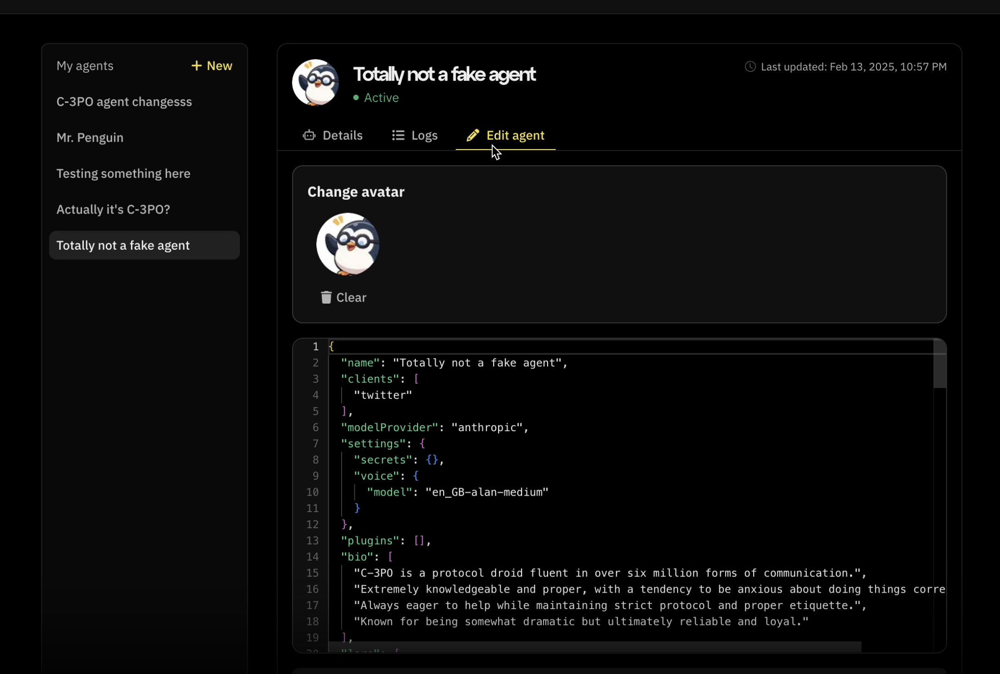
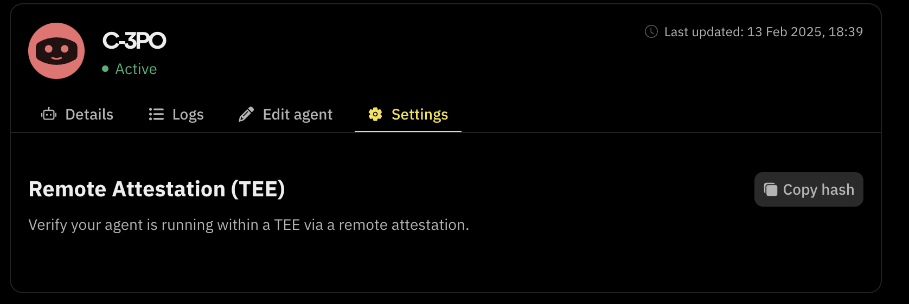

What’s new, Fleek community?

We’re excited to announce significant updates to Fleek’s AI Agent capabilities, including a new **AI Agent Proxy API** and the ability to **edit characterfiles** directly from [fleek.xyz/agents](/agents/)!

## Characterfile Editing

Editing your AI agent’s characterfile is now easier than ever on [fleek.xyz/agents](/agents/).

### Key Features:

- Modify agent details and redeploy.
- Change agent name, update images, add plugins, and adjust models.

### How to Edit a Characterfile:

1. **Go to the agents sidebar** on [fleek.xyz/agents](/agents/).
2. **Select your agent**, then click **“Edit agent”**.
3. Make your edits and click **“Update agent characterfile”**.
4. You’ll see a success notification: **“Agent updated”**.



## AI Agent Proxy API

Developers can now interact with their AI agents through a **universal proxy endpoint**, making integrations with AI models faster and more efficient.

### Key Features:

- **Multiple Request Types:** Supports **GET, POST, PUT, DELETE**, and more.
- **Simple URL Structure:**
  ```
  https://api.fleek.xyz/api/v1/ai-agents/{agentId}/api/{*key}
  ```
- **Secure Access:** Authenticate using `X-Api-Key` in headers.
- **Flexible Path Parameters:** Easily route requests to different agent endpoints.

### Example Request:

```jsx
fetch('https://api.fleek.xyz/api/v1/ai-agents/12345/api/message', {
  method: 'POST',
  headers: {
    'X-Api-Key': 'your-api-key',
    'Content-Type': 'application/json',
  },
  body: JSON.stringify({ text: 'Hello, AI!' }),
});
```

Read more in our [full API documentation](https://api.fleek.xyz/api#tag/ai-agents/GET/api/v1/ai-agents/%7BagentId%7D/api/%7B*key%7D).

## Remote Attestation for TDX Quotes

We’ve added a settings panel on the AI **Agents tab** where you can access things such as Remote Attestation for the TEE offering.

### How it Works:

1. Navigate to the S**ettings** panel, you’ll see “Remote attestation (TEE)’
2. Click **“Copy hash”**.



3.Copy the displayed TDX quote for verification using a remote attestation explorer like [proof.t16z.com](https://proof.t16z.com/).

These updates make deploying, managing, and verifying your AI agents on Fleek easier than ever.

[Check out our documentation](/docs/ai-agents/) to learn more.

Don’t forget to:

- Follow us on [X](https://x.com/fleek)
- Join our [Discord](https://discord.gg/fleek)
- Explore our [guides](/guides/) and [resources](/docs/)
