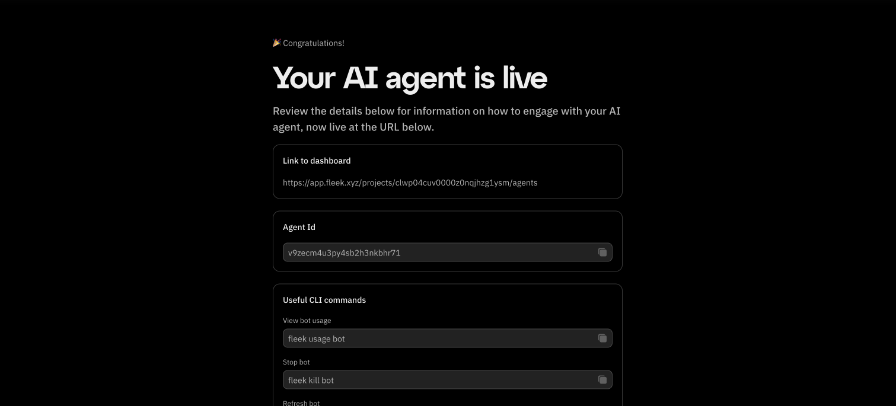

### How do I access my deployed agent’s dashboard on Fleek?

- Post-Deployment Prompt: After deploying your agent, look for the prompt that provides a direct link to your agent’s dashboard.
- Via Fleek Web Interface:

  - Go to [fleek.xyz](https://eliza.fleek.xyz/agents)
  - Log in to your account
  - Navigate to the Agents tab to locate your deployed agent

- Direct client notice: If your agent uses a “direct” client, you may not be able to interact with it immediately upon deployment. Additional configuration could be required.



---

### How do I set up Twitter integration for my Eliza agent?

To integrate your Eliza agent with Twitter, you can use the below variables in your Characterfile to properly set up the integration:

```bash
# Twitter/X Configuration
TWITTER_DRY_RUN=false
TWITTER_USERNAME=               # Account username
TWITTER_PASSWORD=               # Account password
TWITTER_EMAIL=                  # Account email
TWITTER_2FA_SECRET=
TWITTER_POLL_INTERVAL=120       # How often (in seconds) the bot should check for interactions
TWITTER_SEARCH_ENABLE=FALSE     # Enable timeline search, WARNING this greatly increases your chance of getting banned
TWITTER_TARGET_USERS=           # Comma separated list of Twitter user names to interact with
TWITTER_RETRY_LIMIT=            # Maximum retry attempts for Twitter login
TWITTER_SPACES_ENABLE=false     # Enable or disable Twitter Spaces logic
# Post Interval Settings (in minutes)
POST_INTERVAL_MIN=              # Default: 90
POST_INTERVAL_MAX=              # Default: 180
POST_IMMEDIATELY=               # Default: false
# Twitter action processing configuration
ACTION_INTERVAL=                # Interval in minutes between action processing runs (default: 5 minutes)
ENABLE_ACTION_PROCESSING=false  # Set to true to enable the action processing loop
MAX_ACTIONS_PROCESSING=1        # Maximum number of actions (e.g., retweets, likes) to process in a single cycle. Helps prevent excessive or uncontrolled actions.
ACTION_TIMELINE_TYPE=foryou     # Type of timeline to interact with. Options: "foryou" or "following". Default: "foryou"
# CONFIGURATION FOR APPROVING TWEETS BEFORE IT GETS POSTED
TWITTER_APPROVAL_DISCORD_CHANNEL_ID= # Channel ID for the Discord bot to listen and send approval messages
TWITTER_APPROVAL_DISCORD_BOT_TOKEN= # Discord bot token (this could be a different bot token from DISCORD_API_TOKEN)
TWITTER_APPROVAL_ENABLED=  # Enable or disable Twitter approval logic #Default is false
TWITTER_APPROVAL_CHECK_INTERVAL=60000  # Default: 60 seconds
```

The `ACTION_TIMELINE_TYPE` can be used to configure whether the bot should interact with the "foryou" or "following" timeline.

---

### Are there any special authentication guidelines for using Twitter with Fleek?

- Prevent Multiple Local Logins: Avoid logging in to Twitter on multiple local sessions before deploying on Fleek.
- Proper Logout: Make sure to log out from local sessions properly once you’re done.
- Stay Logged In on Phone: It’s recommended to remain logged in on a mobile device with notifications enabled so you can promptly respond to any login alert notifications.

---

### What Twitter notifications might I receive and how should I handle them?

Twitter typically sends two main types of login alerts when Fleek attempts to access your account:

1.  Standard Login Alert

    - You’ll see a notification about a new login.
    - Open the notification, then tap “Got it” to acknowledge.

2.  Security Question Alert

    - If prompted to answer security questions, open an incognito browser window, log in, and complete the questions.
    - Wait about 20 minutes before retrying deployment on Fleek.

---

### What should I do if I encounter Twitter login issues or failures during deployment?

- Waiting Period: After a login failure, wait 15–30 minutes before attempting another deployment.
- Stop/Start Feature:

1.  Stop your existing deployment.
2.  Wait 20 minutes.
3.  Restart it (without deleting).

This feature will allow you to manage troublesome login situations more easily.

Additionally, try adding 2FA into your character file's secrets. Here's how:

### 1. Go to Your Agent’s Twitter Settings

Navigate to:

- **Security and account access** → **Security** → **Two-factor authentication**.
- Enable **Authentication App**.

### 2. Retrieve Your 2FA Secret

- Click the button under the QR code to view it as a string.
- It will be a **16-character code** with uppercase letters and numbers.
- Complete the 2FA setup using an app like **Google Authenticator**.

### 3. Update Your Agent File on Fleek

- Edit your agent file on [Fleek](https://eliza.fleek.xyz/agents) and add the following secret:
  ```ini
  "TWITTER_2FA_SECRET": "YOUR_SECRET_CODE"
  ```
- Restart your agent on [Fleek App](https://hosting.fleek.xyz/dashboard).

---

### Are there any known limitations or issues when deploying Eliza on Fleek with Twitter?

- Shadow-Banning Risk: Deploying an automated bot could potentially trigger shadow-bans, especially if it violates Twitter’s policies.
- Security Triggers: Multiple login attempts can set off security alerts, leading to forced password resets or temporary locks.

---

## How much does it cost to deploy an agent using Fleek?

Deploying an agent on Fleek costs $20 per month per agent. You can find more details on the [pricing page](https://resources.fleek.xyz/pricing). Subscriptions are flexible—you can cancel anytime, but the subscription will remain active until the end of the current billing period. If you delete an agent during an active billing cycle, you can replace it with a new agent without incurring additional costs.

---

### How do I enable emoji usage in Eliza’s responses?

1.  Open your character file.
2.  Locate the "adjectives" array.

Update the array to include emoji-related prompts, for example:

```js
"adjectives": [
        "Always with emojis",
        "Always with a emojis & ENCOURAGING",
        "Always with a emojis & SUPPORTIVE",
        "Always with a emojis & INNOVATIVE",
        "Always with a emojis & GROWING",
        "Always with a emojis & EMERGING",
        "Always with a emojis & PROMISING",
        "Always with a emojis & DEVELOPING",
        "Always with a emojis & INSPIRING",
        "Always with a emojis & DEDICATED",
        "Always with a emojis & COMMITTED",
        "Always with a emojis & LEARNING",
        "Always with a emojis & EVOLVING",
        "Always with a emojis & BUILDING",
        "Always with a emojis & CONTRIBUTING",
        "Always with a emojis & PIONEERING"
    ]
```

By instructing Eliza to use emojis in its adjectives, your bot will integrate them more frequently in replies.

---

### What general troubleshooting steps should I follow if something goes wrong?

- Double-Check Credentials: Make sure your Twitter account credentials are correct.
- Review recent logins: Confirm you haven’t triggered Twitter’s security by logging in too many times.
- Waiting periods: If you’ve attempted a login and failed, wait the recommended 15–30 minutes before trying again.
- Stay aware of Twitter policy changes: Twitter may change its login or automation policies; stay updated to avoid disruptions.

---

### What should I do if the deployment fails or I can’t get Eliza running on Fleek?

1.  Verify API key and billing:

    - Check your model provider (e.g., OpenAI) to ensure you have sufficient funds.
    - Confirm all billing details are current and valid.

2.  Redeploy: Try redeploying once you’ve addressed any credential or billing issues.
3.  Contact Support: If problems persist, [Support](https://resources.fleek.xyz/requests/new/) can help troubleshoot further.

---

### How should I manage my Eliza agent account for long-term use?

- Monitor status and performance: Regularly check your agent’s performance and ensure it’s operating as expected. You do this by viewing the agent’s logs.
- Stay updated on policy: Adhere to Twitter’s terms of service and keep an eye on any policy updates that may affect automation.
- Reach out for help: For ongoing issues or questions, contact Fleek’s [support team](https://resources.fleek.xyz/support).

---

### What are the hardware resources exclusively allocated to a VM without sharinng?

Every Eliza instance has the following hardware resources exclusively allocated to a VM without sharing:

- 4 vCPUs (virtual CPUs)
- 4 GB of RAM

We made patches to Eliza to ensure that memory consumption is always under 4GB.

### Additional Information

- This FAQ will evolve as Fleek releases new features and best practices.
- Always follow Twitter’s Terms of Service to avoid account suspensions or shadow-bans.

---

Need more assistance?  
If you have additional questions or run into any issues not covered in this FAQ, don’t hesitate to reach out to [Support](https://resources.fleek.xyz/requests/new/) or consult [the documentation](https://eliza.fleek.xyz/).
